# Atividade 5 - Arquitetura de Computadores - PPGI

Aluno: Victor José de Sousa Koehler

Matrícula: 20211023501

## Introdução

Neste trabalho é apresentado um breve estudo sobre a representação de estrutura de dados e seu impacto na performance dos algoritmos, em particular na cache. Especificamente, foi implementado um conjunto de algoritmos e filtros típicos de processamento de digital de imagens, uma classe que carrega, armazena na memória principal e encapsula o acesso das imagens, e outras estruturas auxiliares para avaliar e comparar o tempo de execução desses filtros mediante algumas escolhas de representação, acesso e ajuste de paramêtros.

Os códigos de interesse foram implementados na linguagem C++, na versão mínima C++17, compilados utilizando GNU GCC versão 9.4.0 (9.4.0-1ubuntu1~20.04.1) e testados em um computador executando o sistema operacional Ubuntu 20.04.1, kernel Linux versão 5.13.0-40-generic#45, equipado com 8GB de RAM e processador AMD Ryzen 7 5700U cujas capacidades de cache L1 de instruções e dados, L2 e L3 são, respectivamente, 256 KiB, 256 KiB, 4 MiB e 8 MiB, como ilustrado na seguinte imagem:

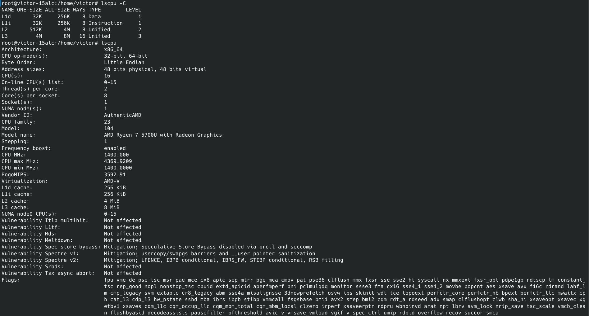


Diferentes perfis de compilação, otimização e parametrização do compilador são explorados mais adiante. A base de código possui duas dependências externas:

- TCLAP (Licença MIT): http://tclap.sourceforge.net/
- CImg (Licença CeCILL-C/CeCILL ): https://cimg.eu/

## Estrutura do Código

A pasta `src/` abriga os arquivos com os códigos-fonte. Nela há três *headers* (cuja extensão é *.hpp*): `benchmark.hpp` contém estruturas auxiliares, `ImagingAlgorithms.hpp` abriga as implementações dos filtros e algoritmos de processamento de imagens e, finalmente, `Image3D.hpp` contém a(s) classe(s) que encapsula(m) uma imagem a ser processada.

### Filtros de Processamento Digital de Imagens (PDI)


<details><summary>Autogenerated code</summary>

```python
import pandas as pd
import seaborn as sns
import matplotlib.pyplot as plt
import numpy as np
import io
from os import listdir as os_listdir

sns.set_theme(style="darkgrid")
```

</details>

A Tabela a seguir apresenta os filtros implementados em `ImagingAlgorithms.hpp` em adição a referência seguida:


<details><summary>Autogenerated code</summary>

```python
pd.set_option('max_colwidth', None)
pd.DataFrame([
    ['Averaging', '#1 de https://www.tannerhelland.com/3643/grayscale-image-algorithm-vb6/'],
    ['Luma', '#2 de https://www.tannerhelland.com/3643/grayscale-image-algorithm-vb6/'],
    ['Sobel', 'https://en.wikipedia.org/wiki/Sobel_operator'],
    ['Box Blur', 'https://en.wikipedia.org/wiki/Box_blur'],
    ['Desaturação', '#3 de https://www.tannerhelland.com/3643/grayscale-image-algorithm-vb6/'],
    ['Decomposição de max', '#4.1 de https://www.tannerhelland.com/3643/grayscale-image-algorithm-vb6/'],
    ['Decomposição de min', '#4.2 de https://www.tannerhelland.com/3643/grayscale-image-algorithm-vb6/']
], columns=['Método', 'Referência']).set_index('Método')
```

</details>


<div>
<style scoped>
    .dataframe tbody tr th:only-of-type {
        vertical-align: middle;
    }

    .dataframe tbody tr th {
        vertical-align: top;
    }

    .dataframe thead th {
        text-align: right;
    }
</style>
<table border="1" class="dataframe">
  <thead>
    <tr style="text-align: right;">
      <th>Método</th>
      <th>Referência</th>
    </tr>
  </thead>
  <tbody>
    <tr>
      <th>Averaging</th>
      <td>#1 de https://www.tannerhelland.com/3643/grayscale-image-algorithm-vb6/</td>
    </tr>
    <tr>
      <th>Luma</th>
      <td>#2 de https://www.tannerhelland.com/3643/grayscale-image-algorithm-vb6/</td>
    </tr>
    <tr>
      <th>Sobel</th>
      <td>https://en.wikipedia.org/wiki/Sobel_operator</td>
    </tr>
    <tr>
      <th>Box Blur</th>
      <td>https://en.wikipedia.org/wiki/Box_blur</td>
    </tr>
    <tr>
      <th>Desaturação</th>
      <td>#3 de https://www.tannerhelland.com/3643/grayscale-image-algorithm-vb6/</td>
    </tr>
    <tr>
      <th>Decomposição de max</th>
      <td>#4.1 de https://www.tannerhelland.com/3643/grayscale-image-algorithm-vb6/</td>
    </tr>
    <tr>
      <th>Decomposição de min</th>
      <td>#4.2 de https://www.tannerhelland.com/3643/grayscale-image-algorithm-vb6/</td>
    </tr>
  </tbody>
</table>
</div>


### Alocação Dinâmica de Matrizes


Tipicamente, uma imagem digital pode ser vista como uma matriz de três dimensões: largura, altura e canais de cor (imagem acima). Embora a linguagem C++ suporte a declaração e inicialização de *arrays* multidimensionais de forma direta, essa é uma operação que exige que (1) pelo menos algumas das dimensões sejam conhecidas em tempo de compilação ou (2) a declaração e uso do *array* sejam realizados apenas dentro de um mesmo escopo de função (assim o compilador pode, silenciosamente, gerar o código que armazena as dimensões dinâmicas do array e realizar os cálculos de acesso). Por exemplo...

```C++
const int A_const = 3, B_const = 2;

void print_matrix_0(int matrix[A_const][B_const]) { ... } // Permitido, A_const e B_const são conhecidos em tempo de execução
void print_matrix_1(int a, int matrix[a][B_const]) { ... } // Erro: não é possível declarar uma matriz cujo tamanho não é conhecido em tempo de compilação
void print_matrix_2(int b, int matrix[A_const][b]) { ... } // Erro: não é possível declarar uma matriz cujo tamanho não é conhecido em tempo de compilação
void print_matrix_3(int matrix[A_const][]) { ... } // Erro: uma matriz deve possuir tamanho especificado em todas as dimensões, exceto a primeira
void print_matrix_4(int matrix[][B_const]) { ... } // Permitido, uma matriz deve possuir tamanho especificado em todas as dimensões, exceto a primeira
void print_matrix_5(int matrix[][B_const][5]) { ... } // Permitido, uma matriz deve possuir tamanho especificado em todas as dimensões, exceto a primeira
void print_matrix_6(int matrix[][][5]) { ... } // Erro: uma matriz deve possuir tamanho especificado em todas as dimensões, exceto a primeira

void example_matrix() {
    int a, b, x, y, z;
    std::cin >> a >> b >> x >> y >> z;
    int matrix[a][b]; // Permitido, o compilador irá silenciosamente guardar as dimensões dessa matriz em tempo de execução
    ...
    matrix[x][y] = z; // e gerará o assembly necessário para acessá-la.
}
```

Assim sendo, a alocação dinâmica de memória no *heap* do programa é frequentemente usada para a criação de matrizes no C++, principalmente ao usar-se classes. Como resultado, duas estratégias de alocação dinâmica são comumente exploradas e indicadas para iniciantes em fóruns na Internet [https://stackoverflow.com/q/16978675, https://stackoverflow.com/q/45047902, https://stackoverflow.com/q/14202593]: A estratégia de alocação de ponteiros de ponteiros (ou vetores) e a alocação de bloco. Dito isso, muitas vezes tais indicações falham em transmitir as vantagens e desvantagens de tais técnicas, e de fato, a primeira delas, quando mal projetada e implementada, pode ser potencialmente nociva ao desempenho dos programas.

#### Alocação de ponteiros de ponteiros: Pointers

A estratégia da alocação de ponteiros de ponteiros (ou vetores), assim chamada nesse trabalho, pode ser exemplificada da seguinte maneira para matrizes bidimensionais:
```C++
int **matrix = new int*[a];
for (int a_i = 0; a_i < a; a_i++)
    matrix[a] = new int[b];
// ou ainda:
std::vector< std::vector<int> > matrix_vector(a, std::vector<int>(b));
```
Ou no caso de matrizes tridimensionais:
```C++
int ***matrix = new int**[a];
for (int a_i = 0; a_i < a; a_i++) {
    matrix[a] = new int*[b];
    for (int b_i = 0; b_i < b; b_i++)
        matrix[a][b] = new int[c];
}
// ou ainda:
std::vector< std::vector< std::vector<int> > > matrix_vector(a, std::vector< std::vector<int> >(b, std::vector<int>(c)));
```
E assim em diante... Como vantagens, essa solução permite que o programador continue acessando a matriz da mesma forma que antes: `matrix[a][b] = z`, por exemplo, bem como oferece um certo grau de flexibilidade em relação a possibilidades de redimensionamento e tamanhos heterogêneos. Porém, nesse tipo de alocação não há, por definição, garantias de que as regiões recém obtidas estejam próximas umas as outras, nem que estejam ordenadas, o que pode afetar gravemente o princípio da localidade da *cache*. Além disso, embora seja permitido qualquer tamanho arbitrário para a invocação da alocação, deve-se levar em conta que o sistema sempre reserva a memória em blocos, então valores excessivamente pequenos de tamanho no último `for`, como a quantidade de canais de cores de uma típica imagem (3), podem sobreutilizar a memória de maneira ineficiente e até mesmo extrapolar a memória disponível no sistema [https://prog21.dadgum.com/179.html, https://man7.org/linux/man-pages/man3/malloc_usable_size.3.html], o que de fato ocorreu nos experimentos realizados demonstrado mais a frente.

Esta é a estratégia adotada no branch [simplified_before](/VictorKoehler/PPGI-ARQ-A5ImageBenchmark/tree/simplified_before).

#### Alocação de blocos: MemBlock

A segunda estratégia consiste em fazer a alocação completa da matriz de uma única vez, o que exige a implementação manual do cálculo da posição do elemento da matriz:

```C++
int a, b, x, y, z;
std::cin >> a >> b >> x >> y >> z;

int *matrix = new int[a*b];
matriz[x][y] = z; // Erro: o compilador não enxerga matrix como uma matriz bi-dimensional
matriz[x*b + y] = z; // Correto: Esse seria o cálculo feito pelo compilador caso fizessemos uma matriz bi-dimensional
```

Esta é a estratégia adotada no branch [simplified_after](/VictorKoehler/PPGI-ARQ-A5ImageBenchmark/tree/simplified_after). É importante notar que o cálculo da posição está sendo realizado na classe Image3DMYXC (arquivo `Image3D.hpp`), de forma a encapsular e manter intactas as implementações dos filtros das imagens (em `ImagingAlgorithms.hpp`).

### Ordem de acesso

Para obtermos medidas práticas, definimos arbitrariamente que todos os filtros serão otimizados para percorrer os pixels da imagem na seguinte sequência: Linha -> coluna -> canal de cor. Isto poderia ser traduzido no seguinte `for`:

```C++
for (int y = 0; y < Linhas; y++) {
    for (int x = 0; x < Colunas; x++) {
        for (int c = 0; c < Canais; c++) {
            operacao_sobre_pixel(x, y, c); // imagem.buffer[x][y][c];
        }
    }
}
```

Dessa forma, mantendo-se fixo a ordem de acesso dos filtros, encapsulamos e alteramos a ordem na qual a classe presente em `Image3D.hpp` armazena a imagem na memória:

- XYC: Coluna -> Linha -> Cor (Estratégia adotada no branch [simplified_before](/VictorKoehler/PPGI-ARQ-A5ImageBenchmark/tree/simplified_before)).
- XCY: Coluna -> Cor -> Linha
- YXC: Linha -> Coluna -> Cor (Estratégia adotada no branch [simplified_after](/VictorKoehler/PPGI-ARQ-A5ImageBenchmark/tree/simplified_after)).
- YCX: Linha -> Cor -> Coluna
- CXY: Cor -> Coluna -> Linha
- CYX: Cor -> Linha -> Coluna

### Resumo das diferenças entre os branches *simplified_before* e *simplified_after*

```C++
/*** BRANCH simplified_before: ***/
struct Image3DXYC {
    uint width, height, channels;
    pixel_unit*** buff;

    void Image3DXYC::init(uint w, uint a, uint c) {
        width = w;
        height = a;
        channels = c;
        if (width*height*channels == 0) return;

        buff = new pixel_unit **[width];
        for (uint c = 0; c < width; c++) {
            buff[c] = new pixel_unit *[height];
            for (uint i = 0; i < height; i++)
                buff[c][i] = new pixel_unit[channels];
        }
    }

    constexpr inline         pixel_unit& at(uint x, uint y, uint c)       { return buff[x][y][c]; }
    constexpr inline const   pixel_unit& at(uint x, uint y, uint c) const { return buff[x][y][c]; }
    
    ...
};
```

```C++
/*** BRANCH simplified_after: ***/
struct Image3DMYXC {
    uint width, height, channels;
    pixel_unit* buff;

    void Image3DMYXC::init(uint w, uint a, uint c) {
        width = w;
        height = a;
        channels = c;
        if (width*height*channels > 0)
            buff = new pixel_unit[width*height*channels];
    }

    constexpr inline         pixel_unit& at(uint x, uint y, uint c)       { return buff[y*width*channels + x*channels + c]; }
    constexpr inline const   pixel_unit& at(uint x, uint y, uint c) const { return buff[y*width*channels + x*channels + c]; }
    
    ...
};
```

### Branch *master*

Finalmente, o branch [master](/VictorKoehler/PPGI-ARQ-A5ImageBenchmark/) implementa todas as estratégias acima mencionadas através da especialização de *templates*. Mais precisamente, ele declara a classe `Image3D`, do arquivo `Image3D.hpp`, através da parametrização em tempo de compilação de dois argumentos: `template<PixelOrder order, bool memblock>`, sendo `PixelOrder` um enumerável definido como `{XYC, XCY, YXC, YCX, CXY, CYX}`, `order` como a ordem de acesso, e `memblock=true` para a utilização da estratégia da Alocação de blocos (MemBlock) ou `memblock=false` para Alocação de ponteiros de ponteiros (Pointers).

Resumindo, estas são as variantes implementadas no branch *master* e utilizadas adiante:

- MemBlock@XYC: Coluna -> Linha -> Cor (memória em bloco)
- MemBlock@XCY: Coluna -> Cor -> Linha (memória em bloco)
- MemBlock@YXC: Linha -> Coluna -> Cor (memória em bloco); Estratégia adotada no branch [simplified_after](/VictorKoehler/PPGI-ARQ-A5ImageBenchmark/tree/simplified_after)
- MemBlock@YCX: Linha -> Cor -> Coluna (memória em bloco)
- MemBlock@CXY: Cor -> Coluna -> Linha (memória em bloco)
- MemBlock@CYX: Cor -> Linha -> Coluna (memória em bloco)
- Pointers@XYC: Coluna -> Linha -> Cor (ponteiros de ponteiros); Estratégia adotada no branch [simplified_before](/VictorKoehler/PPGI-ARQ-A5ImageBenchmark/tree/simplified_before).
- Pointers@XCY: Coluna -> Cor -> Linha (ponteiros de ponteiros)
- Pointers@YXC: Linha -> Coluna -> Cor (ponteiros de ponteiros)
- Pointers@YCX: Linha -> Cor -> Coluna (ponteiros de ponteiros)
- Pointers@CXY: Cor -> Coluna -> Linha (ponteiros de ponteiros)
- Pointers@CYX: Cor -> Linha -> Coluna (ponteiros de ponteiros)
- XYC: Coluna -> Linha -> Cor 
- XCY: Coluna -> Cor -> Linha

Todos os acessos a imagem de entrada são encapsulados por essa classe, o que permite que `ImagingAlgorithms.hpp` seja utilizada sem modificações entre os parâmetros, o que contribui para a imparcialidade dos experimentos. Além disso, recursos especiais da linguagem, como `inline` e `constexpr` foram extensivamente utilizados para garantir que o compilador otimize tanto quanto possível e mitigue *overheads*.


## Experimentos

### Metodologia


<details><summary>Autogenerated code</summary>

```python
df_ = pd.read_csv('log.csv', sep=', ', engine='python', comment='#', names=['implementation', 'file', 'width', 'height', 'channels', 'time'])
_unit_df, _unit_df_eng = 'milisegundos', 'milliseconds'

def df_time_def(i):
    v, u = i.split(' ')
    u_ = {'seconds': 1, 'milliseconds': 0.001, 'microseconds': 10**(-6), 'nanoseconds': 10**(-9)}
    # u_ = {'seconds': 10**(6), 'milliseconds': 100, 'microseconds': 1, 'nanoseconds': 0.001}
    return float(v)*u_[u]/u_[_unit_df_eng]
# df_
```

</details>


<details><summary>Autogenerated code</summary>

```python
def df_gen(df_):
    df = df_.copy()
    df.time = df.time.apply(df_time_def)
    df = pd.concat([pd.DataFrame(list(df['implementation'].str.split('@')), columns=['impl_strat', 'impl_access']), df], axis=1)
    df['D'] = df[['width', 'height', 'channels']].prod(axis=1)
    df = df[df['D'] != 36]
    return df
df = df_gen(df_)
# df
```

</details>

Foram utilizadas 21 imagens de alta definição (sendo algumas delas variantes redimensionadas de outra). Todas são carregadas sem compressão na memória principal. Além disso, os filtros sempre trabalham sobre um *buffer* de mesmo tamanho da imagem original, o que implica que o teto de consumo de memória é (ligeiramente maior que) o dobro da quantidade de *pixels* (largura X altura X canais). A tabela abaixo relaciona a dimensão de cada imagem:


<details><summary>Autogenerated code</summary>

```python
_df1 = df.pivot_table(values='time', index='file', columns=['impl_strat', 'impl_access'], aggfunc='mean')
df[['file', 'width', 'height', 'channels', 'D']].drop_duplicates().rename(
    {'width': 'largura', 'height': 'altura', 'channels': 'canais', 'D': 'Dimensões ( = largura * altura * canais)', 'file': 'Arquivo'}, axis=1).set_index('Arquivo')
```

</details>


<div>
<style scoped>
    .dataframe tbody tr th:only-of-type {
        vertical-align: middle;
    }

    .dataframe tbody tr th {
        vertical-align: top;
    }

    .dataframe thead th {
        text-align: right;
    }
</style>
<table border="1" class="dataframe">
  <thead>
    <tr style="text-align: right;">
      <th></th>
      <th>largura</th>
      <th>altura</th>
      <th>canais</th>
      <th>Dimensões ( = largura * altura * canais)</th>
    </tr>
    <tr>
      <th>Arquivo</th>
      <th></th>
      <th></th>
      <th></th>
      <th></th>
    </tr>
  </thead>
  <tbody>
    <tr>
      <th>input/166370483-56cb36da5f9b5879cc54103c.jpg</th>
      <td>5760</td>
      <td>3840</td>
      <td>3</td>
      <td>66355200</td>
    </tr>
    <tr>
      <th>input/Airbus_Pleiades_50cm_8bit_RGB_Yogyakarta.jpg</th>
      <td>5494</td>
      <td>5839</td>
      <td>3</td>
      <td>96238398</td>
    </tr>
    <tr>
      <th>input/Airbus-Spot6-50cm-St-Benoit-du-Lac-Quebec-2014-09-04.jpg</th>
      <td>5181</td>
      <td>4828</td>
      <td>3</td>
      <td>75041604</td>
    </tr>
    <tr>
      <th>input/Everest_kalapatthar.jpg</th>
      <td>2304</td>
      <td>3456</td>
      <td>3</td>
      <td>23887872</td>
    </tr>
    <tr>
      <th>input/Foto-011.tif</th>
      <td>2784</td>
      <td>1891</td>
      <td>3</td>
      <td>15793632</td>
    </tr>
    <tr>
      <th>input/GeoEye_GeoEye1_50cm_8bit_RGB_DRA_Mining_2009FEB14_8bits_sub_r_15.jpg</th>
      <td>11846</td>
      <td>9945</td>
      <td>3</td>
      <td>353425410</td>
    </tr>
    <tr>
      <th>input/Mount-Nyiragongo-DRC.jpg</th>
      <td>5616</td>
      <td>3744</td>
      <td>3</td>
      <td>63078912</td>
    </tr>
    <tr>
      <th>input/potw1508a.tif</th>
      <td>9000</td>
      <td>2568</td>
      <td>3</td>
      <td>69336000</td>
    </tr>
    <tr>
      <th>input/santa-ana-vulkan.jpg</th>
      <td>12821</td>
      <td>5591</td>
      <td>3</td>
      <td>215046633</td>
    </tr>
    <tr>
      <th>input/skyscraper-clipart-superman-building-superhero-building-cartoon-png.png</th>
      <td>920</td>
      <td>361</td>
      <td>3</td>
      <td>996360</td>
    </tr>
    <tr>
      <th>input/STEVE_High-res_Ryan-Sault.jpg</th>
      <td>8616</td>
      <td>8432</td>
      <td>3</td>
      <td>217950336</td>
    </tr>
    <tr>
      <th>input/Water_of_Leith_by_Keanu_Kerr.jpg</th>
      <td>3840</td>
      <td>2160</td>
      <td>3</td>
      <td>24883200</td>
    </tr>
    <tr>
      <th>input/166370483-56cb36da5f9b5879cc54103c_1k.jpg</th>
      <td>1000</td>
      <td>666</td>
      <td>3</td>
      <td>1998000</td>
    </tr>
    <tr>
      <th>input/166370483-56cb36da5f9b5879cc54103c_2k.jpg</th>
      <td>2000</td>
      <td>1333</td>
      <td>3</td>
      <td>7998000</td>
    </tr>
    <tr>
      <th>input/Everest_kalapatthar_1k.jpg</th>
      <td>1152</td>
      <td>1012</td>
      <td>3</td>
      <td>3497472</td>
    </tr>
    <tr>
      <th>input/Everest_kalapatthar_2k.jpg</th>
      <td>2304</td>
      <td>2025</td>
      <td>3</td>
      <td>13996800</td>
    </tr>
    <tr>
      <th>input/GeoEye_GeoEye1_50cm_8bit_RGB_DRA_Mining_2009FEB14_8bits_sub_r_15_5k.jpg</th>
      <td>5923</td>
      <td>4972</td>
      <td>3</td>
      <td>88347468</td>
    </tr>
    <tr>
      <th>input/GeoEye_GeoEye1_50cm_8bit_RGB_DRA_Mining_2009FEB14_8bits_sub_r_15_8k.jpg</th>
      <td>8884</td>
      <td>7458</td>
      <td>3</td>
      <td>198770616</td>
    </tr>
    <tr>
      <th>input/potw1508a_4k.tif</th>
      <td>4329</td>
      <td>2568</td>
      <td>3</td>
      <td>33350616</td>
    </tr>
    <tr>
      <th>input/potw1508a_7k.tif</th>
      <td>6607</td>
      <td>2568</td>
      <td>3</td>
      <td>50900328</td>
    </tr>
  </tbody>
</table>
</div>


### Comparação entre diferentes Ordens de Acesso e Estratégias de Alocação

Nos experimentos realizados a seguir, o programa foi compilado utilizando o comando `make`, que pela receita padrão do arquivo `Makefile`, utiliza as seguintes opções de compilação: `g++ -O5 -DNDEBUG -Wall -Wextra -Wl,--no-relax -std=c++17 -m64 -fPIC -fno-strict-aliasing -fexceptions -DIL_STD -MM`. A tabela abaixo apresenta os resultados relacionando a dimensão da imagem (linha), por cada algoritmo/estratégia (coluna) em função da soma do tempo de execução de todos os filtros (valores).

Valores em NaN implicam que a estratégia ultrapassou o limite de memória do computador e teve sua execução abruptamente interrompida pelo sistema operacional. É possível notar que, apesar de receberem a mesma imagem, apenas duas estratégias apresentaram esse comportamento: Pointers@XYC e Pointers@YXC. Trata-se do problema mencionado na subseção "Alocação de ponteiros de ponteiros: Pointers" na qual há um sobreuso ineficiente de memória ao tentar-se alocar uma imagem de dimensões (11846, 9945, 3) da seguinte maneira:

```C++
typedef unsigned char pixel_unit;
matrix = new pixel_unit **[width]; // Código de alocação da matriz da estratégia Pointers@XYC
for (uint c = 0; c < width; c++) { // No caso da estratégia Pointers@YXC, inverte-se este for com o de baixo
    matrix[c] = new pixel_unit *[height];
    for (uint i = 0; i < height; i++)
        matrix[c][i] = new pixel_unit[channels]; // mas mantém essa linha, na qual channels = 3
```

Note que a última linha, que aloca de maneira ineficiente 3 `pixel_unit` (3 bytes), é invocada `width*height` vezes, então embora o consumo teórico de memória desta imagem em particular seja 353425410 bytes (0.353425 GB), na prática o consumo atinge níveis suficientes para a invocação do *OOM Killer* do Linux no computador utilizado.


<details><summary>Autogenerated code</summary>

```python
_df2_gen = lambda df: df.pivot_table(values='time', index='D', columns=['impl_strat', 'impl_access'], aggfunc='mean')
_df2 = _df2_gen(df)
_df2
```

</details>


<div>
<style scoped>
    .dataframe tbody tr th:only-of-type {
        vertical-align: middle;
    }

    .dataframe tbody tr th {
        vertical-align: top;
    }

    .dataframe thead tr th {
        text-align: left;
    }

    .dataframe thead tr:last-of-type th {
        text-align: right;
    }
</style>
<table border="1" class="dataframe">
  <thead>
    <tr>
      <th>impl_strat</th>
      <th colspan="6" halign="left">MemBlock</th>
      <th colspan="6" halign="left">Pointers</th>
    </tr>
    <tr>
      <th>impl_access</th>
      <th>CXY</th>
      <th>CYX</th>
      <th>XCY</th>
      <th>XYC</th>
      <th>YCX</th>
      <th>YXC</th>
      <th>CXY</th>
      <th>CYX</th>
      <th>XCY</th>
      <th>XYC</th>
      <th>YCX</th>
      <th>YXC</th>
    </tr>
    <tr>
      <th>D</th>
      <th></th>
      <th></th>
      <th></th>
      <th></th>
      <th></th>
      <th></th>
      <th></th>
      <th></th>
      <th></th>
      <th></th>
      <th></th>
      <th></th>
    </tr>
  </thead>
  <tbody>
    <tr>
      <th>996360</th>
      <td>20.440667</td>
      <td>16.435667</td>
      <td>22.173333</td>
      <td>18.851333</td>
      <td>17.334000</td>
      <td>17.916000</td>
      <td>22.743667</td>
      <td>17.652000</td>
      <td>23.312000</td>
      <td>65.132667</td>
      <td>19.928000</td>
      <td>22.098667</td>
    </tr>
    <tr>
      <th>1998000</th>
      <td>64.114333</td>
      <td>29.502333</td>
      <td>57.353667</td>
      <td>43.738333</td>
      <td>32.949333</td>
      <td>31.083667</td>
      <td>47.737333</td>
      <td>31.879667</td>
      <td>57.574000</td>
      <td>218.473000</td>
      <td>33.549333</td>
      <td>54.399333</td>
    </tr>
    <tr>
      <th>3497472</th>
      <td>77.994667</td>
      <td>52.248333</td>
      <td>76.420667</td>
      <td>67.383333</td>
      <td>55.673667</td>
      <td>52.642667</td>
      <td>128.427333</td>
      <td>52.885333</td>
      <td>87.244000</td>
      <td>246.954667</td>
      <td>54.665333</td>
      <td>77.236333</td>
    </tr>
    <tr>
      <th>7998000</th>
      <td>233.981667</td>
      <td>117.091333</td>
      <td>197.320000</td>
      <td>209.856667</td>
      <td>126.790333</td>
      <td>119.141667</td>
      <td>217.789000</td>
      <td>121.870667</td>
      <td>239.043000</td>
      <td>680.833667</td>
      <td>123.345667</td>
      <td>176.654667</td>
    </tr>
    <tr>
      <th>13996800</th>
      <td>460.019333</td>
      <td>208.473000</td>
      <td>459.114667</td>
      <td>318.461333</td>
      <td>224.091333</td>
      <td>212.956667</td>
      <td>2339.349667</td>
      <td>216.731333</td>
      <td>486.422333</td>
      <td>1207.693667</td>
      <td>213.673333</td>
      <td>338.442000</td>
    </tr>
    <tr>
      <th>15793632</th>
      <td>466.791333</td>
      <td>231.553000</td>
      <td>471.078667</td>
      <td>357.447333</td>
      <td>245.677667</td>
      <td>238.115000</td>
      <td>454.044667</td>
      <td>240.888333</td>
      <td>503.899667</td>
      <td>1173.632667</td>
      <td>240.494333</td>
      <td>342.284000</td>
    </tr>
    <tr>
      <th>23887872</th>
      <td>942.230000</td>
      <td>350.817333</td>
      <td>1047.852333</td>
      <td>591.363000</td>
      <td>375.607333</td>
      <td>363.831667</td>
      <td>926.000000</td>
      <td>365.730000</td>
      <td>1259.111333</td>
      <td>2071.352667</td>
      <td>360.592333</td>
      <td>516.206667</td>
    </tr>
    <tr>
      <th>24883200</th>
      <td>759.130333</td>
      <td>365.757000</td>
      <td>773.745667</td>
      <td>543.332333</td>
      <td>388.356333</td>
      <td>372.281333</td>
      <td>804.035000</td>
      <td>379.279667</td>
      <td>922.715333</td>
      <td>2762.609000</td>
      <td>371.984667</td>
      <td>539.343000</td>
    </tr>
    <tr>
      <th>33350616</th>
      <td>1195.606667</td>
      <td>490.582000</td>
      <td>1211.550333</td>
      <td>735.683333</td>
      <td>521.377667</td>
      <td>505.261667</td>
      <td>1241.799000</td>
      <td>515.663333</td>
      <td>1569.542667</td>
      <td>4683.350333</td>
      <td>505.319000</td>
      <td>795.234667</td>
    </tr>
    <tr>
      <th>50900328</th>
      <td>2492.329667</td>
      <td>755.580667</td>
      <td>2557.156667</td>
      <td>1418.318667</td>
      <td>792.941667</td>
      <td>770.896333</td>
      <td>2703.547333</td>
      <td>784.621000</td>
      <td>4978.812000</td>
      <td>10545.231667</td>
      <td>776.434333</td>
      <td>1188.224667</td>
    </tr>
    <tr>
      <th>63078912</th>
      <td>3263.519333</td>
      <td>934.540333</td>
      <td>4591.378000</td>
      <td>1636.500667</td>
      <td>962.469333</td>
      <td>942.192000</td>
      <td>3154.772333</td>
      <td>972.868333</td>
      <td>11120.778333</td>
      <td>15377.141667</td>
      <td>958.501333</td>
      <td>1345.092667</td>
    </tr>
    <tr>
      <th>66355200</th>
      <td>9158.682333</td>
      <td>963.540000</td>
      <td>11510.572000</td>
      <td>3705.418667</td>
      <td>1016.346000</td>
      <td>980.333000</td>
      <td>3317.960333</td>
      <td>1009.695000</td>
      <td>12005.939333</td>
      <td>17846.753333</td>
      <td>991.657333</td>
      <td>1437.234667</td>
    </tr>
    <tr>
      <th>69336000</th>
      <td>4694.248333</td>
      <td>1023.933667</td>
      <td>5688.455667</td>
      <td>1558.097000</td>
      <td>1061.930667</td>
      <td>1041.550333</td>
      <td>5827.827333</td>
      <td>1071.747667</td>
      <td>10810.875667</td>
      <td>18164.506000</td>
      <td>1046.877333</td>
      <td>1481.054333</td>
    </tr>
    <tr>
      <th>75041604</th>
      <td>3919.411333</td>
      <td>1100.601333</td>
      <td>5288.495667</td>
      <td>1973.654000</td>
      <td>1161.531667</td>
      <td>1117.459000</td>
      <td>3935.947667</td>
      <td>1154.039333</td>
      <td>12715.313000</td>
      <td>18067.555333</td>
      <td>1131.692333</td>
      <td>1599.297333</td>
    </tr>
    <tr>
      <th>88347468</th>
      <td>5242.465333</td>
      <td>1307.342333</td>
      <td>7767.239000</td>
      <td>2423.848667</td>
      <td>1386.223667</td>
      <td>1333.235333</td>
      <td>6337.413333</td>
      <td>1371.185333</td>
      <td>17499.515333</td>
      <td>26414.231333</td>
      <td>1347.790000</td>
      <td>1895.345667</td>
    </tr>
    <tr>
      <th>96238398</th>
      <td>6049.649667</td>
      <td>1418.701667</td>
      <td>7019.030667</td>
      <td>2569.690667</td>
      <td>1485.179333</td>
      <td>1443.217333</td>
      <td>6004.635000</td>
      <td>1489.578000</td>
      <td>16645.077667</td>
      <td>24190.003333</td>
      <td>1456.632667</td>
      <td>2069.328667</td>
    </tr>
    <tr>
      <th>198770616</th>
      <td>32702.273667</td>
      <td>2983.268333</td>
      <td>26173.870000</td>
      <td>6535.113000</td>
      <td>3087.256000</td>
      <td>3021.726000</td>
      <td>29500.116333</td>
      <td>3098.926333</td>
      <td>62346.572667</td>
      <td>99275.444667</td>
      <td>3046.404333</td>
      <td>4264.367333</td>
    </tr>
    <tr>
      <th>215046633</th>
      <td>40798.701667</td>
      <td>3179.306667</td>
      <td>37767.531000</td>
      <td>9971.327667</td>
      <td>3290.931000</td>
      <td>3260.121333</td>
      <td>43676.689667</td>
      <td>3361.746667</td>
      <td>69456.694000</td>
      <td>106470.324667</td>
      <td>3271.913667</td>
      <td>4627.885000</td>
    </tr>
    <tr>
      <th>217950336</th>
      <td>37460.001333</td>
      <td>3204.053667</td>
      <td>28663.491333</td>
      <td>7035.605000</td>
      <td>3330.743000</td>
      <td>3260.772667</td>
      <td>42435.586000</td>
      <td>3357.801667</td>
      <td>66226.905333</td>
      <td>102756.291667</td>
      <td>3274.343667</td>
      <td>4661.320333</td>
    </tr>
    <tr>
      <th>353425410</th>
      <td>94195.424667</td>
      <td>5238.211000</td>
      <td>59692.441333</td>
      <td>18928.665333</td>
      <td>5450.456667</td>
      <td>5331.179667</td>
      <td>98720.135667</td>
      <td>5538.269333</td>
      <td>114701.010667</td>
      <td>NaN</td>
      <td>5374.813333</td>
      <td>NaN</td>
    </tr>
  </tbody>
</table>
</div>


A mesma tabela anterior, mas ordenada de modo que a estratégia mais a esquerda possui o menor tempo computacional total/médio.


<details><summary>Autogenerated code</summary>

```python
def _df2s_gen(df):
    _df2s = _df2_gen(df)
    _df2s.loc['mean'] = _df2s.mean(numeric_only=True, axis=0)
    _df2s.sort_values(by='mean', axis=1, inplace=True)
    _df2s.drop('mean', inplace=True)
    return _df2s
_df2s = _df2s_gen(df)
_df2s
```

</details>


<div>
<style scoped>
    .dataframe tbody tr th:only-of-type {
        vertical-align: middle;
    }

    .dataframe tbody tr th {
        vertical-align: top;
    }

    .dataframe thead tr th {
        text-align: left;
    }

    .dataframe thead tr:last-of-type th {
        text-align: right;
    }
</style>
<table border="1" class="dataframe">
  <thead>
    <tr>
      <th>impl_strat</th>
      <th colspan="2" halign="left">MemBlock</th>
      <th>Pointers</th>
      <th>MemBlock</th>
      <th colspan="2" halign="left">Pointers</th>
      <th colspan="3" halign="left">MemBlock</th>
      <th colspan="3" halign="left">Pointers</th>
    </tr>
    <tr>
      <th>impl_access</th>
      <th>CYX</th>
      <th>YXC</th>
      <th>YCX</th>
      <th>YCX</th>
      <th>CYX</th>
      <th>YXC</th>
      <th>XYC</th>
      <th>XCY</th>
      <th>CXY</th>
      <th>CXY</th>
      <th>XCY</th>
      <th>XYC</th>
    </tr>
    <tr>
      <th>D</th>
      <th></th>
      <th></th>
      <th></th>
      <th></th>
      <th></th>
      <th></th>
      <th></th>
      <th></th>
      <th></th>
      <th></th>
      <th></th>
      <th></th>
    </tr>
  </thead>
  <tbody>
    <tr>
      <th>996360</th>
      <td>16.435667</td>
      <td>17.916000</td>
      <td>19.928000</td>
      <td>17.334000</td>
      <td>17.652000</td>
      <td>22.098667</td>
      <td>18.851333</td>
      <td>22.173333</td>
      <td>20.440667</td>
      <td>22.743667</td>
      <td>23.312000</td>
      <td>65.132667</td>
    </tr>
    <tr>
      <th>1998000</th>
      <td>29.502333</td>
      <td>31.083667</td>
      <td>33.549333</td>
      <td>32.949333</td>
      <td>31.879667</td>
      <td>54.399333</td>
      <td>43.738333</td>
      <td>57.353667</td>
      <td>64.114333</td>
      <td>47.737333</td>
      <td>57.574000</td>
      <td>218.473000</td>
    </tr>
    <tr>
      <th>3497472</th>
      <td>52.248333</td>
      <td>52.642667</td>
      <td>54.665333</td>
      <td>55.673667</td>
      <td>52.885333</td>
      <td>77.236333</td>
      <td>67.383333</td>
      <td>76.420667</td>
      <td>77.994667</td>
      <td>128.427333</td>
      <td>87.244000</td>
      <td>246.954667</td>
    </tr>
    <tr>
      <th>7998000</th>
      <td>117.091333</td>
      <td>119.141667</td>
      <td>123.345667</td>
      <td>126.790333</td>
      <td>121.870667</td>
      <td>176.654667</td>
      <td>209.856667</td>
      <td>197.320000</td>
      <td>233.981667</td>
      <td>217.789000</td>
      <td>239.043000</td>
      <td>680.833667</td>
    </tr>
    <tr>
      <th>13996800</th>
      <td>208.473000</td>
      <td>212.956667</td>
      <td>213.673333</td>
      <td>224.091333</td>
      <td>216.731333</td>
      <td>338.442000</td>
      <td>318.461333</td>
      <td>459.114667</td>
      <td>460.019333</td>
      <td>2339.349667</td>
      <td>486.422333</td>
      <td>1207.693667</td>
    </tr>
    <tr>
      <th>15793632</th>
      <td>231.553000</td>
      <td>238.115000</td>
      <td>240.494333</td>
      <td>245.677667</td>
      <td>240.888333</td>
      <td>342.284000</td>
      <td>357.447333</td>
      <td>471.078667</td>
      <td>466.791333</td>
      <td>454.044667</td>
      <td>503.899667</td>
      <td>1173.632667</td>
    </tr>
    <tr>
      <th>23887872</th>
      <td>350.817333</td>
      <td>363.831667</td>
      <td>360.592333</td>
      <td>375.607333</td>
      <td>365.730000</td>
      <td>516.206667</td>
      <td>591.363000</td>
      <td>1047.852333</td>
      <td>942.230000</td>
      <td>926.000000</td>
      <td>1259.111333</td>
      <td>2071.352667</td>
    </tr>
    <tr>
      <th>24883200</th>
      <td>365.757000</td>
      <td>372.281333</td>
      <td>371.984667</td>
      <td>388.356333</td>
      <td>379.279667</td>
      <td>539.343000</td>
      <td>543.332333</td>
      <td>773.745667</td>
      <td>759.130333</td>
      <td>804.035000</td>
      <td>922.715333</td>
      <td>2762.609000</td>
    </tr>
    <tr>
      <th>33350616</th>
      <td>490.582000</td>
      <td>505.261667</td>
      <td>505.319000</td>
      <td>521.377667</td>
      <td>515.663333</td>
      <td>795.234667</td>
      <td>735.683333</td>
      <td>1211.550333</td>
      <td>1195.606667</td>
      <td>1241.799000</td>
      <td>1569.542667</td>
      <td>4683.350333</td>
    </tr>
    <tr>
      <th>50900328</th>
      <td>755.580667</td>
      <td>770.896333</td>
      <td>776.434333</td>
      <td>792.941667</td>
      <td>784.621000</td>
      <td>1188.224667</td>
      <td>1418.318667</td>
      <td>2557.156667</td>
      <td>2492.329667</td>
      <td>2703.547333</td>
      <td>4978.812000</td>
      <td>10545.231667</td>
    </tr>
    <tr>
      <th>63078912</th>
      <td>934.540333</td>
      <td>942.192000</td>
      <td>958.501333</td>
      <td>962.469333</td>
      <td>972.868333</td>
      <td>1345.092667</td>
      <td>1636.500667</td>
      <td>4591.378000</td>
      <td>3263.519333</td>
      <td>3154.772333</td>
      <td>11120.778333</td>
      <td>15377.141667</td>
    </tr>
    <tr>
      <th>66355200</th>
      <td>963.540000</td>
      <td>980.333000</td>
      <td>991.657333</td>
      <td>1016.346000</td>
      <td>1009.695000</td>
      <td>1437.234667</td>
      <td>3705.418667</td>
      <td>11510.572000</td>
      <td>9158.682333</td>
      <td>3317.960333</td>
      <td>12005.939333</td>
      <td>17846.753333</td>
    </tr>
    <tr>
      <th>69336000</th>
      <td>1023.933667</td>
      <td>1041.550333</td>
      <td>1046.877333</td>
      <td>1061.930667</td>
      <td>1071.747667</td>
      <td>1481.054333</td>
      <td>1558.097000</td>
      <td>5688.455667</td>
      <td>4694.248333</td>
      <td>5827.827333</td>
      <td>10810.875667</td>
      <td>18164.506000</td>
    </tr>
    <tr>
      <th>75041604</th>
      <td>1100.601333</td>
      <td>1117.459000</td>
      <td>1131.692333</td>
      <td>1161.531667</td>
      <td>1154.039333</td>
      <td>1599.297333</td>
      <td>1973.654000</td>
      <td>5288.495667</td>
      <td>3919.411333</td>
      <td>3935.947667</td>
      <td>12715.313000</td>
      <td>18067.555333</td>
    </tr>
    <tr>
      <th>88347468</th>
      <td>1307.342333</td>
      <td>1333.235333</td>
      <td>1347.790000</td>
      <td>1386.223667</td>
      <td>1371.185333</td>
      <td>1895.345667</td>
      <td>2423.848667</td>
      <td>7767.239000</td>
      <td>5242.465333</td>
      <td>6337.413333</td>
      <td>17499.515333</td>
      <td>26414.231333</td>
    </tr>
    <tr>
      <th>96238398</th>
      <td>1418.701667</td>
      <td>1443.217333</td>
      <td>1456.632667</td>
      <td>1485.179333</td>
      <td>1489.578000</td>
      <td>2069.328667</td>
      <td>2569.690667</td>
      <td>7019.030667</td>
      <td>6049.649667</td>
      <td>6004.635000</td>
      <td>16645.077667</td>
      <td>24190.003333</td>
    </tr>
    <tr>
      <th>198770616</th>
      <td>2983.268333</td>
      <td>3021.726000</td>
      <td>3046.404333</td>
      <td>3087.256000</td>
      <td>3098.926333</td>
      <td>4264.367333</td>
      <td>6535.113000</td>
      <td>26173.870000</td>
      <td>32702.273667</td>
      <td>29500.116333</td>
      <td>62346.572667</td>
      <td>99275.444667</td>
    </tr>
    <tr>
      <th>215046633</th>
      <td>3179.306667</td>
      <td>3260.121333</td>
      <td>3271.913667</td>
      <td>3290.931000</td>
      <td>3361.746667</td>
      <td>4627.885000</td>
      <td>9971.327667</td>
      <td>37767.531000</td>
      <td>40798.701667</td>
      <td>43676.689667</td>
      <td>69456.694000</td>
      <td>106470.324667</td>
    </tr>
    <tr>
      <th>217950336</th>
      <td>3204.053667</td>
      <td>3260.772667</td>
      <td>3274.343667</td>
      <td>3330.743000</td>
      <td>3357.801667</td>
      <td>4661.320333</td>
      <td>7035.605000</td>
      <td>28663.491333</td>
      <td>37460.001333</td>
      <td>42435.586000</td>
      <td>66226.905333</td>
      <td>102756.291667</td>
    </tr>
    <tr>
      <th>353425410</th>
      <td>5238.211000</td>
      <td>5331.179667</td>
      <td>5374.813333</td>
      <td>5450.456667</td>
      <td>5538.269333</td>
      <td>NaN</td>
      <td>18928.665333</td>
      <td>59692.441333</td>
      <td>94195.424667</td>
      <td>98720.135667</td>
      <td>114701.010667</td>
      <td>NaN</td>
    </tr>
  </tbody>
</table>
</div>


A mesma tabela ordenada anterior, mas colorida e anotada com as somatórias das linhas e colunas (a direita e em baixo), bem como inclui uma linha extra com a porcentagem relativa a implementação de melhor desempenho.

Valores em vermelho claro implicam que a estratégia ultrapassou o limite de memória do computador e teve sua execução abruptamente interrompida pelo sistema operacional.


<details><summary>Autogenerated code</summary>

```python
def _df2s_heatmap(_df2s):
    fig_sz = (22, 10)
    fig = plt.figure(figsize=fig_sz)
    fig_d, fig_d1, fig_u1 = 40, 36, 4
    ax1 = plt.subplot2grid((fig_d, fig_d), (0, 0), colspan=fig_d1, rowspan=fig_d1, title='Tempo de execução (em '+_unit_df+') das implementações por dimensões ( = largura * altura * canais)')
    axb = plt.subplot2grid((fig_d, fig_d), (fig_d1, 0), colspan=fig_d1, rowspan=fig_u1)
    axr = plt.subplot2grid((fig_d, fig_d), (0, fig_d1), colspan=fig_u1, rowspan=fig_d1)

    _g = sns.heatmap(np.log(_df2s), annot=_df2s, ax=ax1, fmt='.3f', robust=True, cmap="YlGnBu", linecolor='b', cbar = False)
    _g.set_facecolor('xkcd:salmon')
    # sns.heatmap(pv, ax=ax1, annot=True, cmap="YlGnBu",mask=mask, linecolor='b', cbar = False)
    ax1.xaxis.tick_top()
    ax1.set_xticklabels(_df2s.columns,rotation=40)
    def __hmap_sides(d, axis, colorvalue=False):
        r = pd.DataFrame(d.sum(axis=axis))
        if colorvalue:
            if axis == 0: r['%'] = r
            r = np.log(r)
        elif axis == 0:
            class DummyStrFormater(str):
                def __init__(self, s):
                    self.s = s            
                def __format__(self, fmt):
                    return self.s

            r['%'] = (r/r.min()).applymap(lambda x: DummyStrFormater('{:.2f}%'.format(100*x)))
        return r.transpose() if axis == 0 else r

    sns.heatmap(__hmap_sides(_df2s, 0, True), annot=__hmap_sides(_df2s, 0), ax=axb, fmt='.1f', robust=True, cmap="YlGnBu", cbar=False, xticklabels=False)
    sns.heatmap(__hmap_sides(_df2s, 1, True), annot=__hmap_sides(_df2s, 1), ax=axr, fmt='.1f', robust=True, cmap="YlGnBu", cbar=False, xticklabels=False, yticklabels=False)
    ax1.set_ylabel('Dimensões ( = largura * altura * canais)')
    axb.set_xlabel('Estratégia')
    axr.set_ylabel('')
    axr.set_title('(Soma)')
    axb.set_yticklabels(['(Soma)', '%'], rotation=0)
    # _ = snsheatmap(np.log(_df2s), title='', xlabel='')

_df2s_heatmap(_df2s)
```

</details>


    
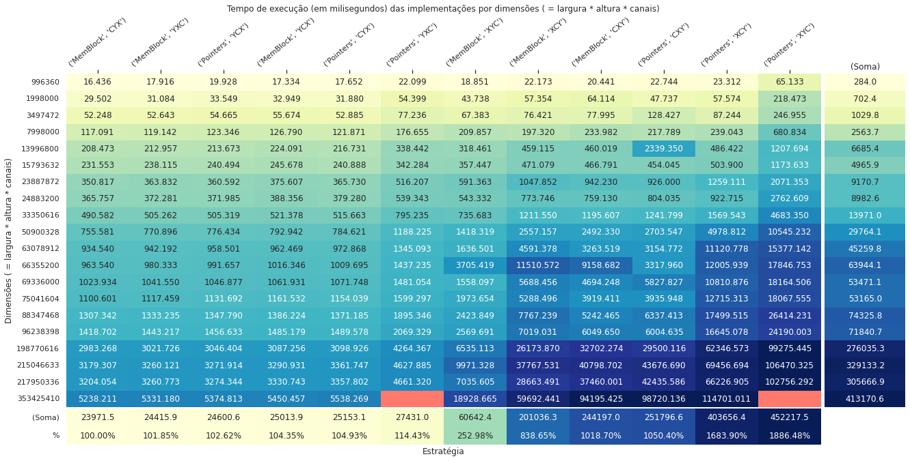
    


É possível observar nas tabelas que as implementações MemBlock@CYX, MemBlock@YXC, Pointers@YCX, MemBlock@YCX, Pointers@CYX e Pointers@YXC, todas nas quais as linhas são indexadas antes das colunas (em harmonia com a forma de acesso dos filtros) foram melhores, em média, em termos de tempo de execução do que aquelas em que ocorre o contrário (MemBlock@XYC, MemBlock@XCY, MemBlock@CXY, Pointers@CXY, Pointers@XCY, Pointers@XYC), tornando possível dividir naturalmente a tabela em duas partes: As 6 primeiras colunas da tabela compreendem as estratégias linhas -> colunas (YX), e as 6 últimas contém os resultados das classes que alocaram as matrizes no formato colunas -> linhas (XY). De fato, a implementação MemBlock@CYX, que obteve os menores tempos, foi 2.5 vezes mais rápida que MemBlock@XYC, e 18 vezes mais rápida que Pointers@XYC.

Dito isso, a posição de acesso do canal de cor não apresentou impacto significativo no desempenho (ao menos nas 6 primeiras colunas), tanto é que a implementação com melhor desempenho, MemBlock@CYX, acessa os elementos indexando-os por meio de cor -> linha -> coluna, diferente da forma fixada previamente na implementação dos filtros das imagens (linha -> coluna -> cor = YXC). Assim sendo, MemBlock@CYX é consistentemente 1.8% mais rápida que MemBlock@YXC e 4.3% mais rápida que MemBlock@YCX.

Ademais, a estratégia da alocação de bloco de memória mostrou-se apenas ligeiramente superior nas seis primeiras colunas, com MemBlock@CYX sendo 2.62% mais rápida que Pointers@YCX e 4.92% que Pointers@CYX. Porém nas últimas colunas, as quais empregam implementações ineficientes de acesso aos índices, tal estratégia não apenas demonstrou-se claramente superior a *Pointers*, mas apresentou clara evidência de melhora de acordo com a posição que o canal de cores ocupa: MemBlock@XYC tomou 60642.35 milissegundos, MemBlock@XCY 201036.27 milissegundos e MemBlock@CXY 244197.01 milissegundos.

Por fim, os gráficos a seguir apresentam uma visão das tabelas apresentadas anteriormente:


<details><summary>Autogenerated code</summary>

```python
def default_plot(title='', xlabel=None, ylabel=None, invok=None, figsize=(16, 10), **kwargs):
    fig = plt.gcf()
    fig.set_size_inches(*figsize)
    fig.set_facecolor('white')
    if invok is not None: invok(fig, **kwargs)
    plt.title(title)
    if xlabel: plt.xlabel(xlabel)
    if ylabel: plt.ylabel(ylabel)
    return fig
```

</details>


<details><summary>Autogenerated code</summary>

```python
def _plot_linegraph(df, extr='', ret=False, set_xlim=None, set_ylim=None, lim_autoadjust=True):
    default_plot('Tempo de execução (em '+_unit_df+') das implementações por dimensões ( = largura * altura * canais)' + extr,
        'Dimensões', 'Tempo de execução em '+_unit_df, figsize=(22, 10))
    # grid = sns.pointplot(x="D", y="time", hue="impl_access", linestyle="impl_strat", data=df)
    # grid.set(xscale="log", yscale="log")
    r = sns.lineplot(x="D", y="time", markers=True, hue="impl_access", style="impl_strat", data=df)
    if set_xlim:
        r.set_xlim(*set_xlim)
        if lim_autoadjust and not set_ylim:
            rdf = df[(set_xlim[0] <= df['D']) & (df['D'] <= set_xlim[1])]['time']
            padd = 0.05*(rdf.max() - rdf.min())
            r.set_ylim(rdf.min() - padd, rdf.max() + padd)
    if set_ylim:
        r.set_ylim(*set_ylim)
        if lim_autoadjust and not set_xlim:
            rdf = df[(set_ylim[0] <= df['time']) & (df['time'] <= set_ylim[1])]['D']
            r.set_xlim(rdf.min() - padd, rdf.max() + padd)
    if ret: return r
_plot_linegraph(df)
```

</details>


    
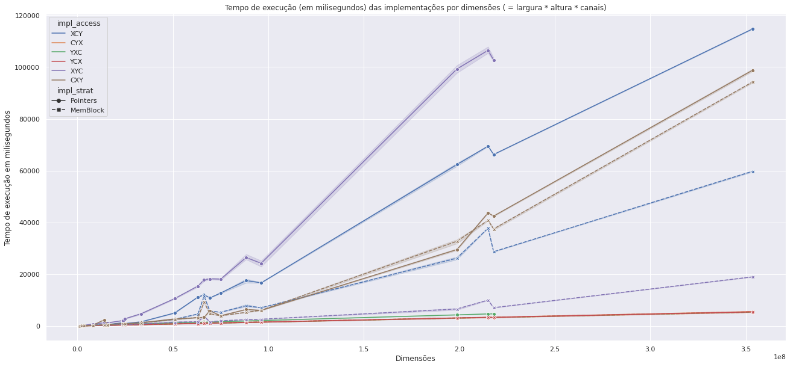
    


<details><summary>Autogenerated code</summary>

```python
_plot_linegraph(df, ', x < 1e8', set_xlim=(0, 10**8))
```

</details>


    
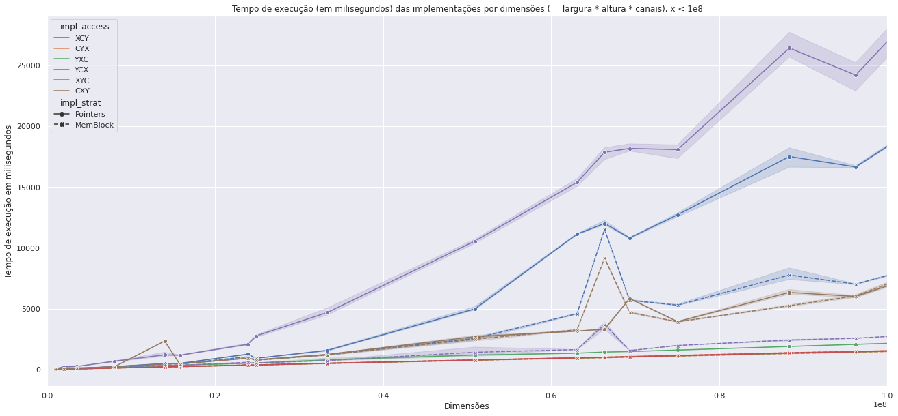
    


<details><summary>Autogenerated code</summary>

```python
_plot_linegraph(df, ', x < 0.4 * 1e8', set_xlim=(0, 0.35*10**8))
```

</details>


    
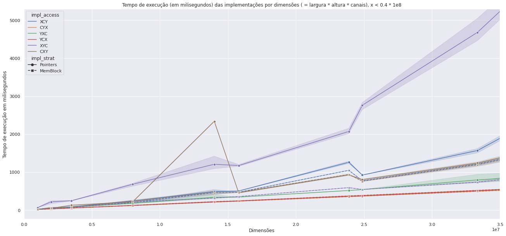
    


<details><summary>Autogenerated code</summary>

```python
_plot_linegraph(df, ', x < 0.4 * 1e8, y < 1600', set_xlim=(0, 0.35*10**8), set_ylim=(0, 1.6*1e3))
```

</details>


    
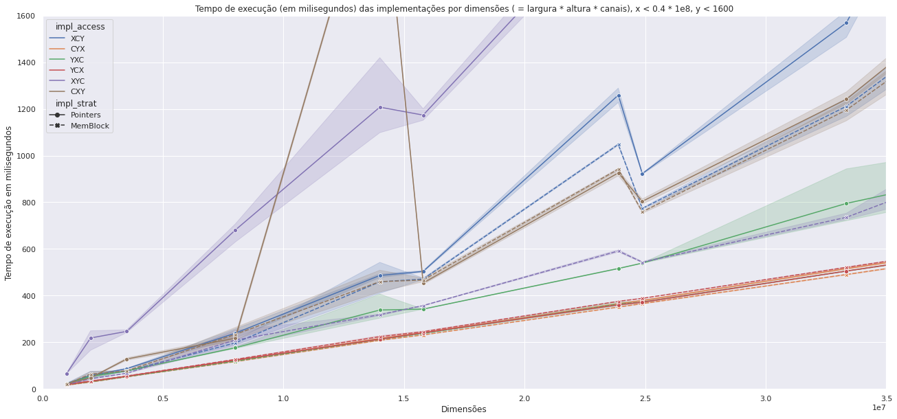
    


<details><summary>Autogenerated code</summary>

```python

def snsheatmap(*args, **kwargs):
    def _hm(fig, **kwargs):
        kwargs.setdefault('annot', True)
        kwargs.setdefault('fmt', 'g')
        kwargs.setdefault('robust', True)
        kwargs.setdefault('cmap', 'YlGnBu')
        sns.heatmap(*args, **kwargs)
    return default_plot(figsize=(16, 6), invok=_hm, **kwargs)

# _ = snsheatmap(np.log(_df1s), annot=_df1s, title='Tempo de execução (em '+_unit_df+') das implementações por arquivo', xlabel='Estratégia')

def get_imagesize(fn):
    from PIL import ImageFile

    ImPar=ImageFile.Parser()
    with open(fn, "rb") as f:
        ImPar=ImageFile.Parser()
        chunk = f.read(2048)
        count=2048
        while chunk != "":
            ImPar.feed(chunk)
            if ImPar.image:
                break
            chunk = f.read(2048)
            count+=2048
        return ImPar.image.size  # count

def get_images_input_folder(prefix='../input/'):
    return [prefix + i for i in os_listdir(prefix)]

# input_images_sizes = {i: get_imagesize(i) for i in get_images_input_folder()}
# __iis = pd.DataFrame([[i[0]*i[1], max(i[0], i[1])] for i in input_images_sizes.values()], columns=['x', 'y'])
# grid = sns.jointplot(data=__iis, x='x', y='y', height=6)
# plt.title('Title')
# # grid.set_axis_labels('aX', 'aY')

# default_plot(figsize=(16, 6))
# sns.histplot(df, x='D', stat='percent')
```

</details>

### Análise utilizando a ferramenta perf


<details><summary>Autogenerated code</summary>

```python
def read_file_lines(fn):
    with open(fn, 'r') as fh:
        return fh.readlines()

def read_file_lines_optdif(fn):
    f = read_file_lines(fn)
    # clp = next((x[x.find(':')+2:] for x in f if 'solver' in x), '')
    def lineproc(i):
        # return prefix + i.strip() + ', ' + fn + ', ' + clp.strip() + '\n'
        return i.strip() + ', ' + fn.split('.')[-3] + (', Sim' if 'opt' in fn else ', Não') + '\n'
    return ''.join((i if i.startswith('#') else lineproc(i)) for i in f if i.strip())

_perf_ctext ='\n'.join([read_file_lines_optdif(i) for i in os_listdir('.') if '.csv' in i and 'perf' in i])
perf_df = (pd.read_csv(io.StringIO(_perf_ctext), sep=', ', engine='python', comment='#', 
                                         names=['implementation', 'file', 'width', 'height', 'channels', 'time', 'filtro', 'otimizado']))
# perf_df
```

</details>

Por fim, foram realizados alguns experimentos envolvendo a utilização da ferramenta `perf` do Linux para a demonstração da efetividade de algumas das técnicas apresentadas. Para tornar melhorar a visualização dos resultados, o programa foi compilado e testado em duas variantes distintas de acordo com o nível de otimização aplicado pelo compilador:

- Otimizado = Sim: Compilado utilizando o comando `make SYMBOLS=1`, cuja receita especifica as seguintes opções de compilação: `g++ -O5 -g3 -DNDEBUG -Wall -Wextra -Wl,--no-relax -std=c++17 -m64 -fPIC -fno-strict-aliasing -fexceptions -DIL_STD -MM`

- Otimizado = Não: Compilado utilizando o comando `make DEBUG=1 FSANITIZE=0`, cuja receita especifica as seguintes opções de compilação: `g++ -O0 -g3 -DONDEBUG -fno-omit-frame-pointer -Wall -Wextra -Wl,--no-relax -std=c++17 -m64 -fPIC -fno-strict-aliasing -fexceptions -DIL_STD -MM`

Tal diferenciação permite-nos visualizar quão agressivas e efetivas são as otimizações aplicadas pelo compilador em cima do código do branch *master*. A Tabela a seguir relaciona o desempenho dessas duas compilações de acordo com 3 filtros e 2 estratégias de implementação enquanto monitoradas pela ferramenta `perf record` em uma imagem em particular:


<details><summary>Autogenerated code</summary>

```python
df_gen(perf_df).pivot_table(values='time', index=['filtro', 'otimizado'], columns=['impl_strat', 'impl_access'], aggfunc='sum')
```

</details>


<div>
<style scoped>
    .dataframe tbody tr th:only-of-type {
        vertical-align: middle;
    }

    .dataframe tbody tr th {
        vertical-align: top;
    }

    .dataframe thead tr th {
        text-align: left;
    }

    .dataframe thead tr:last-of-type th {
        text-align: right;
    }
</style>
<table border="1" class="dataframe">
  <thead>
    <tr>
      <th></th>
      <th>impl_strat</th>
      <th>MemBlock</th>
      <th>Pointers</th>
    </tr>
    <tr>
      <th></th>
      <th>impl_access</th>
      <th>YXC</th>
      <th>XYC</th>
    </tr>
    <tr>
      <th>filtro</th>
      <th>otimizado</th>
      <th></th>
      <th></th>
    </tr>
  </thead>
  <tbody>
    <tr>
      <th rowspan="2" valign="top">luma</th>
      <th>Não</th>
      <td>4421.947</td>
      <td>54484.455</td>
    </tr>
    <tr>
      <th>Sim</th>
      <td>291.159</td>
      <td>14514.548</td>
    </tr>
    <tr>
      <th rowspan="2" valign="top">sobel</th>
      <th>Não</th>
      <td>29861.077</td>
      <td>82207.161</td>
    </tr>
    <tr>
      <th>Sim</th>
      <td>1936.343</td>
      <td>28270.986</td>
    </tr>
    <tr>
      <th rowspan="2" valign="top">sobel_v2</th>
      <th>Não</th>
      <td>40265.409</td>
      <td>90596.368</td>
    </tr>
    <tr>
      <th>Sim</th>
      <td>5164.282</td>
      <td>30235.507</td>
    </tr>
  </tbody>
</table>
</div>


O comando `perf stat` evidencia o impacto no *pipeline* e *cache* que a implementação Pointers@XYC, menos eficiente e intencionalmente programada com acesso invertido, possui: Durante a execução do filtro Sobel, o backend da CPU esteve 90% dos ciclos ocioso, provocando uma média de 0.37 instruções por ciclo e, conversamente, 2.47 ciclos estagnados por instrução. Por outro lado, na execução do mesmo problema com a mesma entrada, a implementação MemBlock@YXC obteve 70% de ciclos ociosos no backend da CPU, alcançando a marca de 2.24 instruções por ciclo e apenas 0.32 ciclos estagnados por instruções:

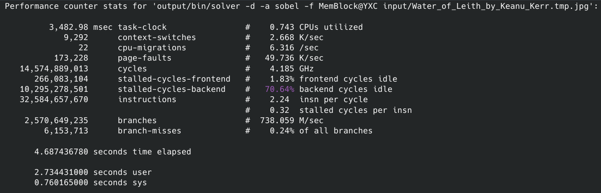
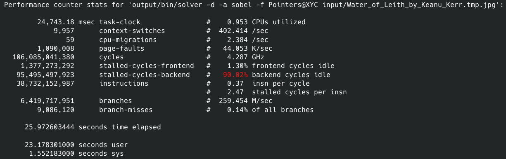

Além disso, é possível observar tanto através da ferramenta `perf report` quanto ao analisar o binário resultante, que, apesar das funções de acesso da imagem estarem devidamente encapsuladas em funções de alto nível na classe `Image3D` do arquivo `Image3D.hpp`, separada das implementações dos filtros (e estes utilizando essas funções de alto nível), o compilador foi completamente capaz de abstrair tais conceitos e fazer o *inlining* do *assembly* resultante. Note, nas imagens a seguir, que no binário otimizado não consta contribuições da classe Image3D, enquanto na versão **não**-otimizada as três primeiras linhas do relatório -e consequentemente aquelas com maior contribuição de tempo- são métodos da classe.

Resumo das contribuições em tempo de execução das funções do binário **NÃO**-otimizado (Sobel, MemBlock@YXC):
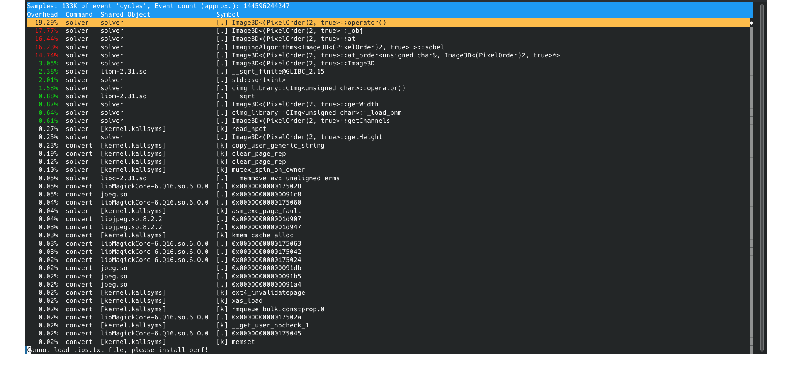

Resumo das contribuições em tempo de execução das funções do binário otimizado (Sobel, MemBlock@YXC):
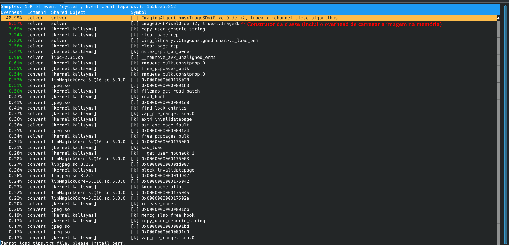

Nas imagens seguintes, é possível observar diversas instruções dedicadas a chamada de função (`callq`) presentes no assembly da versão **não**-otimizada, e nenhuma na versão otimizada:

Assembly da função *sobel* do binário **NÃO**-otimizado (Sobel, MemBlock@YXC):
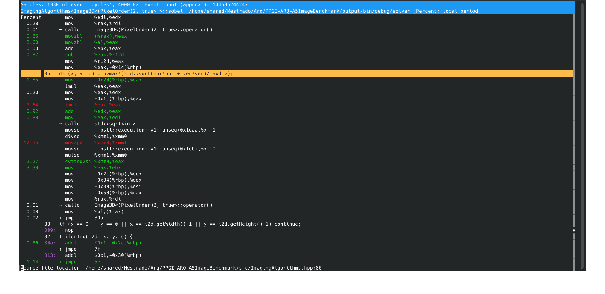

Assembly da função *sobel* do binário otimizado (Sobel, MemBlock@YXC):
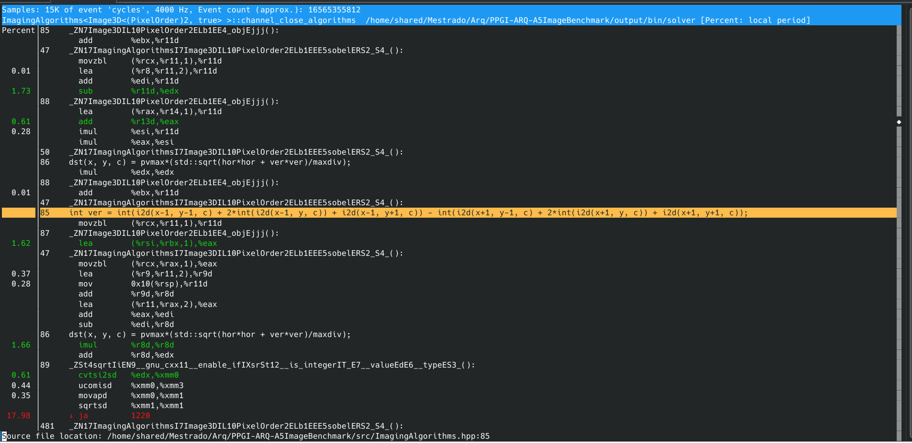

Ademais, é possível observar que a linha que possui a raiz quadrada tem um impacto significativo no desempenho da função:

Visão geral da função *sobel* em código, linha 86:
```C++
// Terminologia temporária: pixel = Unidade de uma imagem composta (geralmente) por três componentes de cor
//                        : subpixel = Componente valorado de cor de um pixel
const auto pvmax = ...; // Valor máximo que um subpixel pode assumir (geralmente 255)
const auto maxdiv = ...; // Valor máximo que a raiz quadrada std::sqrt(hor*hor + ver*ver) pode assumir (no Sobel)
triforImg(i2d, x, y, c) { // Macro para criação do for
    int hor = ..., ver = ...;
    // Linha 86: Ao dividir a raiz abaixo pelo valor máximo que ela pode assumir (maxdiv), seu intervalo ficará entre 0.0 e 1.0 (real)...
    dst(x, y, c) = pvmax*(std::sqrt(hor*hor + ver*ver)/maxdiv); // ...então ao multiplicar-se por 255, tem-se o intervalo 0 a 255 (pvmax)
    // dst é o buffer de saída, e também é uma imagem, logo cada subpixel deve estar entre 0 e 255
}
```

Assembly da função *sobel* do binário otimizado, linha 86 (Parte 1), (Sobel, MemBlock@YXC):
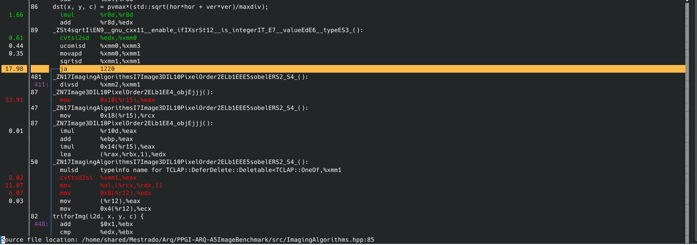

Assembly da função *sobel* do binário otimizado, linha 86 (Parte 2), (Sobel, MemBlock@YXC):
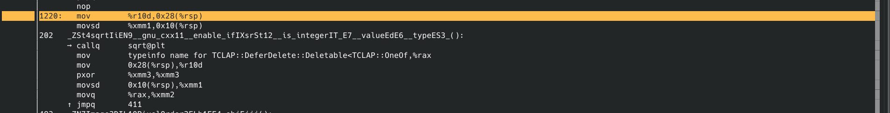

Assim sendo, uma modificação chamada *sobel_v2* foi desenvolvida com o intuito de remover a raiz quadrada, bem como sua multiplicação e divisão externa. Considerando que a expressão da raiz é convertida para um inteiro no intervalo de 0 a 255, e levando em conta que a soma do produtório pode atingir valores exorbitantes, foi implementado uma busca binária em um *array* de tamanho 256 cujos valores consistem na expressão calculada em cima do índice. Dessa forma, seriam necessárias apenas O(log2(N))=log2(256)=8 operações de comparação por iteração para obter um resultado equivalente da expressão da raiz. Lamentavelmente a estratégia desempenhou pior que a original, como demonstrado na Tabela apresentada anteriormente.

Visão geral da função *sobel_v2* em código:
```C++
// Terminologia temporária: pixel = Unidade de uma imagem composta (geralmente) por três componentes de cor
//                        : subpixel = Componente valorado de cor de um pixel
const auto pvmax = ...; // Valor máximo que um subpixel pode assumir (geralmente 255)
const auto maxdiv = ...; // Valor máximo que a raiz quadrada std::sqrt(hor*hor + ver*ver) pode assumir (no Sobel)
int bsrch[pvmax];
for (int i = 0; i < pvmax; i++) {
    const auto i_ = double((i+1)*maxdiv)/double(pvmax);
    bsrch[i] = int(i_*i_);
}
triforImg(i2d, x, y, c) { // Macro para criação do for
    int hor = ..., ver = ...;
    const int g2 = hor*hor + ver*ver;
    const int a = busca_binaria(bsrch, g2);
    dst(x, y, c) = a; // onde a é o índice na qual bsrch[a-1] <= g2 < bsrch[a]
}
```

Assembly da função *sobel_v2* do binário otimizado, destacando o overhead das instruções de pulo (Sobel_v2, MemBlock@YXC):
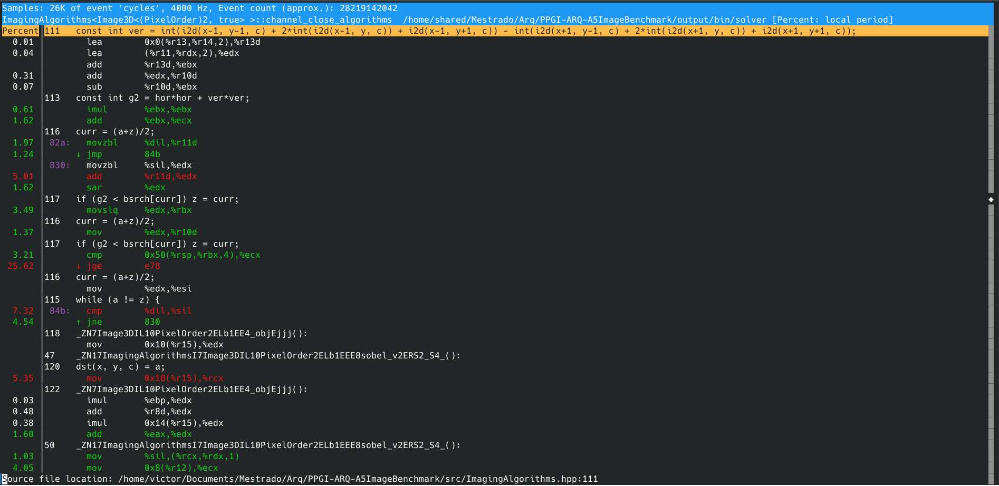
