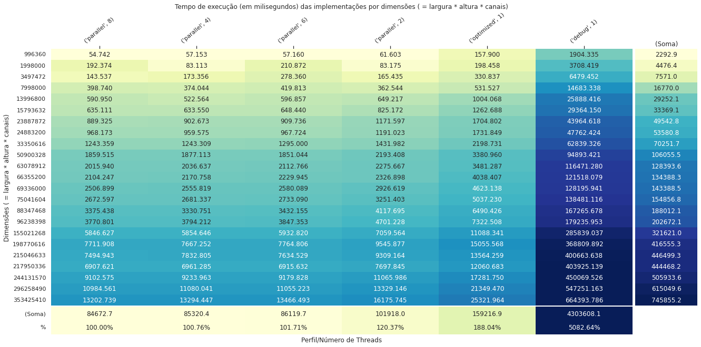

# Atividade 8 - Arquitetura de Computadores - PPGI

Aluno: Victor José de Sousa Koehler

Matrícula: 20211023501

## Introdução

Neste trabalho é apresentado um breve estudo sobre a utilização de técnicas de paralelismo em um conjunto simples de algoritmos de Processamento Digital de Imagens. Mais especificamente, esta é uma continuação do repositório [https://github.com/VictorKoehler/PPGI-ARQ-A5ImageBenchmark](https://github.com/VictorKoehler/PPGI-ARQ-A5ImageBenchmark) contendo modificações para habilitar o paralelismo dos métodos implementados através da API OpenMP. Ainda neste documento, são exibidos gráficos e tabelas comparativas dos experimentos computacionais realizados sobre a implementação original e as modificações propostas, de acordo com seus parâmetros.

Os códigos de interesse foram implementados na linguagem C++, na versão mínima C++17, compilados utilizando GNU GCC versão 9.4.0 (9.4.0-1ubuntu1~20.04.1) e testados em um computador executando o sistema operacional Ubuntu 20.04.1, kernel Linux versão 5.13.0-44-generic#49, equipado com 8GB de RAM e processador Intel Core i5 7200U que possui dois núcleos físicos, cada um capaz de executar simultaneamente duas threads pela tecnologia *Hyper-Threading*, totalizando 4 núcleos virtuais.


A base de código possui duas dependências externas:

- TCLAP (Licença MIT): http://tclap.sourceforge.net/
- CImg (Licença CeCILL-C/CeCILL ): https://cimg.eu/

## Metodologia


<details><summary>Autogenerated code</summary>

```python
import pandas as pd
import seaborn as sns
import matplotlib.pyplot as plt
import numpy as np
import io
from os import listdir as os_listdir

sns.set_theme(style="darkgrid")
```

</details>


<details><summary>Autogenerated code</summary>

```python
df_ = pd.read_csv('log.csv', sep=', ', engine='python', comment='#', names=['implementation', 'variant', 'file', 'width', 'height', 'channels', 'time'])
_unit_df, _unit_df_eng = 'milisegundos', 'milliseconds'

def df_time_def(i):
    v, u = i.split(' ')
    u_ = {'seconds': 1, 'milliseconds': 0.001, 'microseconds': 10**(-6), 'nanoseconds': 10**(-9)}
    # u_ = {'seconds': 10**(6), 'milliseconds': 100, 'microseconds': 1, 'nanoseconds': 0.001}
    return float(v)*u_[u]/u_[_unit_df_eng]
# df_
```

</details>


<details><summary>Autogenerated code</summary>

```python
def df_gen(df_):
    df = df_.copy()
    df.time = df.time.apply(df_time_def)
    df['threads'] = df.implementation.apply(lambda x: int(x.split('_')[-1]) if 'parallel' in x else 1)
    df['implementation_'] = df.implementation.apply(lambda w: w.replace('log_', '').replace('log', 'optimized').replace('_', ' '))
    df.implementation = df.implementation.apply(lambda w: w.replace('log_', '').replace('log', 'optimized').split('_')[0])
    # df = pd.concat([pd.DataFrame(list(df['implementation'].str.split('@')), columns=['impl_strat', 'impl_access']), df], axis=1)
    df['D'] = df[['width', 'height', 'channels']].prod(axis=1)
    df = df[df['D'] != 36]
    return df
df = df_gen(df_)
```

</details>


Foram utilizadas 21 imagens de alta definição (sendo algumas delas variantes redimensionadas de outra). Todas são carregadas sem compressão na memória principal. Além disso, os filtros sempre trabalham sobre um *buffer* de mesmo tamanho da imagem original, o que implica que o teto de consumo de memória é (ligeiramente maior que) o dobro da quantidade de *pixels* (largura X altura X canais). A tabela abaixo relaciona a dimensão de cada imagem:


<details><summary>Autogenerated code</summary>

```python
_df1 = df.pivot_table(values='time', index='file', columns=['implementation'], aggfunc='mean')
df[['file', 'width', 'height', 'channels', 'D']].drop_duplicates().rename(
    {'width': 'largura', 'height': 'altura', 'channels': 'canais', 'D': 'Dimensões ( = largura * altura * canais)', 'file': 'Arquivo'}, axis=1).set_index('Arquivo')
```

</details>


<div>
<table border="1" class="dataframe">
  <thead>
    <tr style="text-align: right;">
      <th></th>
      <th>largura</th>
      <th>altura</th>
      <th>canais</th>
      <th>Dimensões ( = largura * altura * canais)</th>
    </tr>
    <tr>
      <th>Arquivo</th>
      <th></th>
      <th></th>
      <th></th>
      <th></th>
    </tr>
  </thead>
  <tbody>
    <tr>
      <th>input/166370483-56cb36da5f9b5879cc54103c_1k.jpg</th>
      <td>1000</td>
      <td>666</td>
      <td>3</td>
      <td>1998000</td>
    </tr>
    <tr>
      <th>input/166370483-56cb36da5f9b5879cc54103c_2k.jpg</th>
      <td>2000</td>
      <td>1333</td>
      <td>3</td>
      <td>7998000</td>
    </tr>
    <tr>
      <th>input/166370483-56cb36da5f9b5879cc54103c.jpg</th>
      <td>5760</td>
      <td>3840</td>
      <td>3</td>
      <td>66355200</td>
    </tr>
    <tr>
      <th>input/Airbus_Pleiades_50cm_8bit_RGB_Yogyakarta.jpg</th>
      <td>5494</td>
      <td>5839</td>
      <td>3</td>
      <td>96238398</td>
    </tr>
    <tr>
      <th>input/Airbus-Spot6-50cm-St-Benoit-du-Lac-Quebec-2014-09-04.jpg</th>
      <td>5181</td>
      <td>4828</td>
      <td>3</td>
      <td>75041604</td>
    </tr>
    <tr>
      <th>input/Everest_kalapatthar_1k.jpg</th>
      <td>1152</td>
      <td>1012</td>
      <td>3</td>
      <td>3497472</td>
    </tr>
    <tr>
      <th>input/Everest_kalapatthar_2k.jpg</th>
      <td>2304</td>
      <td>2025</td>
      <td>3</td>
      <td>13996800</td>
    </tr>
    <tr>
      <th>input/Everest_kalapatthar.jpg</th>
      <td>2304</td>
      <td>3456</td>
      <td>3</td>
      <td>23887872</td>
    </tr>
    <tr>
      <th>input/Foto-011.tif</th>
      <td>2784</td>
      <td>1891</td>
      <td>3</td>
      <td>15793632</td>
    </tr>
    <tr>
      <th>input/GeoEye_GeoEye1_50cm_8bit_RGB_DRA_Mining_2009FEB14_8bits_sub_r_15_10k.jpg</th>
      <td>10846</td>
      <td>9105</td>
      <td>3</td>
      <td>296258490</td>
    </tr>
    <tr>
      <th>input/GeoEye_GeoEye1_50cm_8bit_RGB_DRA_Mining_2009FEB14_8bits_sub_r_15_5k.jpg</th>
      <td>5923</td>
      <td>4972</td>
      <td>3</td>
      <td>88347468</td>
    </tr>
    <tr>
      <th>input/GeoEye_GeoEye1_50cm_8bit_RGB_DRA_Mining_2009FEB14_8bits_sub_r_15_7k.jpg</th>
      <td>7846</td>
      <td>6586</td>
      <td>3</td>
      <td>155021268</td>
    </tr>
    <tr>
      <th>input/GeoEye_GeoEye1_50cm_8bit_RGB_DRA_Mining_2009FEB14_8bits_sub_r_15_8k.jpg</th>
      <td>8884</td>
      <td>7458</td>
      <td>3</td>
      <td>198770616</td>
    </tr>
    <tr>
      <th>input/GeoEye_GeoEye1_50cm_8bit_RGB_DRA_Mining_2009FEB14_8bits_sub_r_15_9k.jpg</th>
      <td>9846</td>
      <td>8265</td>
      <td>3</td>
      <td>244131570</td>
    </tr>
    <tr>
      <th>input/GeoEye_GeoEye1_50cm_8bit_RGB_DRA_Mining_2009FEB14_8bits_sub_r_15.jpg</th>
      <td>11846</td>
      <td>9945</td>
      <td>3</td>
      <td>353425410</td>
    </tr>
    <tr>
      <th>input/Mount-Nyiragongo-DRC.jpg</th>
      <td>5616</td>
      <td>3744</td>
      <td>3</td>
      <td>63078912</td>
    </tr>
    <tr>
      <th>input/potw1508a_4k.tif</th>
      <td>4329</td>
      <td>2568</td>
      <td>3</td>
      <td>33350616</td>
    </tr>
    <tr>
      <th>input/potw1508a_7k.tif</th>
      <td>6607</td>
      <td>2568</td>
      <td>3</td>
      <td>50900328</td>
    </tr>
    <tr>
      <th>input/potw1508a.tif</th>
      <td>9000</td>
      <td>2568</td>
      <td>3</td>
      <td>69336000</td>
    </tr>
    <tr>
      <th>input/santa-ana-vulkan.jpg</th>
      <td>12821</td>
      <td>5591</td>
      <td>3</td>
      <td>215046633</td>
    </tr>
    <tr>
      <th>input/skyscraper-clipart-superman-building-superhero-building-cartoon-png.png</th>
      <td>920</td>
      <td>361</td>
      <td>3</td>
      <td>996360</td>
    </tr>
    <tr>
      <th>input/STEVE_High-res_Ryan-Sault.jpg</th>
      <td>8616</td>
      <td>8432</td>
      <td>3</td>
      <td>217950336</td>
    </tr>
    <tr>
      <th>input/Water_of_Leith_by_Keanu_Kerr.jpg</th>
      <td>3840</td>
      <td>2160</td>
      <td>3</td>
      <td>24883200</td>
    </tr>
    <tr>
      <th>input/Water_of_Leith_by_Keanu_Kerr.tmp.jpg</th>
      <td>12821</td>
      <td>5591</td>
      <td>3</td>
      <td>215046633</td>
    </tr>
  </tbody>
</table>
</div>


### Modificações introduzidas

O commit cb7ba874acf1ee5968b2b96a79d4a0cd276a6a1d introduziu as seguintes modificações no arquivo `src/ImagingAlgorithms.hpp`, como visto na imagem mais abaixo: Quando `PARALLELIZE` é especificado durante a compilação, o *header* do OpenMP é incluído e a macro `ONLY_IN_PARALLEL` é definida de modo a expandir para o parâmetro `x` fornecido; Do contrário, `ONLY_IN_PARALLEL` suprime os parâmetros, resultando em uma expansão vazia. Como resultado, as *macros* `biforT` e `triforT` expandem, respectivamente, para *for*s aninhados duplos e triplos, que, quando compilados com `PARALLELIZE`, são automaticamente colapsados em um único *loop* de forma a gerar um único e uniforme espaço de iteração paralelizavel pela API através dos *pragmas* `omp parallel for collapse(X)`, onde `X` corresponde a quantidade de *for*s aninhados. Considerando que todos os métodos implementados fazem uso direta ou indiretamente dessas *macros*, estas alterações são suficientes para permitir tirar proveito dos múltiplos núcleos de processadores modernos.


### Comparação entre diferentes perfis de otimização e paralelismo

Nos resultados dos experimentos apresentados na seção seguinte, três perfis de compilação foram utilizados através das configurações especificadas no arquivo `Makefile`:

- *debug*, que utiliza as seguintes opções de compilação: `g++ -O0 -DONDEBUG -fno-omit-frame-pointer -fsanitize=address -fsanitize=leak -fsanitize=null -fsanitize=signed-integer-overflow -g3 -DGITFLAG -Wall -Wextra -Wl,--no-relax -std=c++17 -m64 -fPIC -fno-strict-aliasing -fexceptions -DIL_STD`.

- *optimized*, que utiliza as seguintes opções de compilação: `g++ -O3 -DNDEBUG -march=native -ffast-math -DGITFLAG -Wall -Wextra -Wl,--no-relax -std=c++17 -m64 -fPIC -fno-strict-aliasing -fexceptions -DIL_STD`.

- *parallel*, que utiliza as seguintes opções de compilação: `g++ -O3 -DNDEBUG -march=native -ffast-math -DPARALLELIZE -fopenmp -DGITFLAG -Wall -Wextra -Wl,--no-relax -std=c++17 -m64 -fPIC -fno-strict-aliasing -fexceptions -DIL_STD`.

Note que *parallel* possui as mesmas opções de compilação que *optimized*, mas este último suporta apenas a execução *single thread* devido a expansão da macro `ONLY_IN_PARALLEL`.

## Experimentos

A tabela abaixo apresenta os resultados relacionando a dimensão em *bytes* da imagem (linha), por cada perfil/quantidade de *threads* (coluna) em função da soma do tempo de execução de todos os filtros (valores).


<details><summary>Autogenerated code</summary>

```python
_df2_gen = lambda df: df.pivot_table(values='time', index='D', columns=['implementation', 'threads'], aggfunc='mean')
_df2 = _df2_gen(df)
_df2
```

</details>


<div>
<table border="1" class="dataframe">
  <thead>
    <tr>
      <th>implementation</th>
      <th>debug</th>
      <th>optimized</th>
      <th colspan="4" halign="left">parallel</th>
    </tr>
    <tr>
      <th>threads</th>
      <th>1</th>
      <th>1</th>
      <th>2</th>
      <th>4</th>
      <th>6</th>
      <th>8</th>
    </tr>
    <tr>
      <th>D</th>
      <th></th>
      <th></th>
      <th></th>
      <th></th>
      <th></th>
      <th></th>
    </tr>
  </thead>
  <tbody>
    <tr>
      <th>996360</th>
      <td>1904.335</td>
      <td>157.900</td>
      <td>61.603</td>
      <td>57.1530</td>
      <td>57.160</td>
      <td>54.7420</td>
    </tr>
    <tr>
      <th>1998000</th>
      <td>3708.419</td>
      <td>198.458</td>
      <td>83.175</td>
      <td>83.1130</td>
      <td>210.872</td>
      <td>192.3740</td>
    </tr>
    <tr>
      <th>3497472</th>
      <td>6479.452</td>
      <td>330.837</td>
      <td>165.435</td>
      <td>173.3560</td>
      <td>278.360</td>
      <td>143.5370</td>
    </tr>
    <tr>
      <th>7998000</th>
      <td>14683.338</td>
      <td>531.527</td>
      <td>362.544</td>
      <td>374.0440</td>
      <td>419.813</td>
      <td>398.7400</td>
    </tr>
    <tr>
      <th>13996800</th>
      <td>25888.416</td>
      <td>1004.068</td>
      <td>649.217</td>
      <td>522.5640</td>
      <td>596.857</td>
      <td>590.9500</td>
    </tr>
    <tr>
      <th>15793632</th>
      <td>29364.150</td>
      <td>1262.688</td>
      <td>825.172</td>
      <td>633.5500</td>
      <td>648.440</td>
      <td>635.1110</td>
    </tr>
    <tr>
      <th>23887872</th>
      <td>43964.618</td>
      <td>1704.802</td>
      <td>1171.597</td>
      <td>902.6730</td>
      <td>909.736</td>
      <td>889.3250</td>
    </tr>
    <tr>
      <th>24883200</th>
      <td>47762.424</td>
      <td>1731.849</td>
      <td>1191.023</td>
      <td>959.5750</td>
      <td>967.724</td>
      <td>968.1730</td>
    </tr>
    <tr>
      <th>33350616</th>
      <td>62839.326</td>
      <td>2198.731</td>
      <td>1431.982</td>
      <td>1243.3090</td>
      <td>1295.000</td>
      <td>1243.3590</td>
    </tr>
    <tr>
      <th>50900328</th>
      <td>94893.421</td>
      <td>3380.960</td>
      <td>2193.408</td>
      <td>1877.1130</td>
      <td>1851.044</td>
      <td>1859.5150</td>
    </tr>
    <tr>
      <th>63078912</th>
      <td>116471.280</td>
      <td>3481.287</td>
      <td>2275.667</td>
      <td>2036.6370</td>
      <td>2112.766</td>
      <td>2015.9400</td>
    </tr>
    <tr>
      <th>66355200</th>
      <td>121518.079</td>
      <td>4038.407</td>
      <td>2326.898</td>
      <td>2170.7580</td>
      <td>2229.945</td>
      <td>2104.2470</td>
    </tr>
    <tr>
      <th>69336000</th>
      <td>128195.941</td>
      <td>4623.138</td>
      <td>2926.619</td>
      <td>2555.8190</td>
      <td>2580.089</td>
      <td>2506.8990</td>
    </tr>
    <tr>
      <th>75041604</th>
      <td>138481.116</td>
      <td>5037.230</td>
      <td>3251.403</td>
      <td>2681.3370</td>
      <td>2733.090</td>
      <td>2672.5970</td>
    </tr>
    <tr>
      <th>88347468</th>
      <td>167265.678</td>
      <td>6490.426</td>
      <td>4117.695</td>
      <td>3330.7510</td>
      <td>3432.155</td>
      <td>3375.4380</td>
    </tr>
    <tr>
      <th>96238398</th>
      <td>179235.953</td>
      <td>7322.508</td>
      <td>4701.228</td>
      <td>3794.2120</td>
      <td>3847.353</td>
      <td>3770.8010</td>
    </tr>
    <tr>
      <th>155021268</th>
      <td>285839.037</td>
      <td>11088.341</td>
      <td>7059.564</td>
      <td>5854.6460</td>
      <td>5932.820</td>
      <td>5846.6270</td>
    </tr>
    <tr>
      <th>198770616</th>
      <td>368809.892</td>
      <td>15055.568</td>
      <td>9545.877</td>
      <td>7667.2520</td>
      <td>7764.806</td>
      <td>7711.9080</td>
    </tr>
    <tr>
      <th>215046633</th>
      <td>400663.638</td>
      <td>13564.259</td>
      <td>9309.164</td>
      <td>7832.8045</td>
      <td>7634.529</td>
      <td>7494.9435</td>
    </tr>
    <tr>
      <th>217950336</th>
      <td>403925.139</td>
      <td>12060.683</td>
      <td>7697.845</td>
      <td>6961.2850</td>
      <td>6915.632</td>
      <td>6907.6210</td>
    </tr>
    <tr>
      <th>244131570</th>
      <td>450069.526</td>
      <td>17281.750</td>
      <td>11065.986</td>
      <td>9233.9630</td>
      <td>9179.828</td>
      <td>9102.5750</td>
    </tr>
    <tr>
      <th>296258490</th>
      <td>547251.163</td>
      <td>21349.470</td>
      <td>13329.146</td>
      <td>11080.0410</td>
      <td>11055.223</td>
      <td>10984.5610</td>
    </tr>
    <tr>
      <th>353425410</th>
      <td>664393.786</td>
      <td>25321.964</td>
      <td>16175.745</td>
      <td>13294.4470</td>
      <td>13466.493</td>
      <td>13202.7390</td>
    </tr>
  </tbody>
</table>
</div>


A mesma tabela anterior, mas ordenada de modo que a estratégia mais a esquerda possui o menor tempo computacional total/médio:


<details><summary>Autogenerated code</summary>

```python
def _df2s_gen(df):
    _df2s = _df2_gen(df)
    _df2s.loc['mean'] = _df2s.mean(numeric_only=True, axis=0)
    _df2s.sort_values(by='mean', axis=1, inplace=True)
    _df2s.drop('mean', inplace=True)
    return _df2s
_df2s = _df2s_gen(df)
_df2s
```

</details>


<div>
<table border="1" class="dataframe">
  <thead>
    <tr>
      <th>implementation</th>
      <th colspan="4" halign="left">parallel</th>
      <th>optimized</th>
      <th>debug</th>
    </tr>
    <tr>
      <th>threads</th>
      <th>8</th>
      <th>4</th>
      <th>6</th>
      <th>2</th>
      <th>1</th>
      <th>1</th>
    </tr>
    <tr>
      <th>D</th>
      <th></th>
      <th></th>
      <th></th>
      <th></th>
      <th></th>
      <th></th>
    </tr>
  </thead>
  <tbody>
    <tr>
      <th>996360</th>
      <td>54.7420</td>
      <td>57.1530</td>
      <td>57.160</td>
      <td>61.603</td>
      <td>157.900</td>
      <td>1904.335</td>
    </tr>
    <tr>
      <th>1998000</th>
      <td>192.3740</td>
      <td>83.1130</td>
      <td>210.872</td>
      <td>83.175</td>
      <td>198.458</td>
      <td>3708.419</td>
    </tr>
    <tr>
      <th>3497472</th>
      <td>143.5370</td>
      <td>173.3560</td>
      <td>278.360</td>
      <td>165.435</td>
      <td>330.837</td>
      <td>6479.452</td>
    </tr>
    <tr>
      <th>7998000</th>
      <td>398.7400</td>
      <td>374.0440</td>
      <td>419.813</td>
      <td>362.544</td>
      <td>531.527</td>
      <td>14683.338</td>
    </tr>
    <tr>
      <th>13996800</th>
      <td>590.9500</td>
      <td>522.5640</td>
      <td>596.857</td>
      <td>649.217</td>
      <td>1004.068</td>
      <td>25888.416</td>
    </tr>
    <tr>
      <th>15793632</th>
      <td>635.1110</td>
      <td>633.5500</td>
      <td>648.440</td>
      <td>825.172</td>
      <td>1262.688</td>
      <td>29364.150</td>
    </tr>
    <tr>
      <th>23887872</th>
      <td>889.3250</td>
      <td>902.6730</td>
      <td>909.736</td>
      <td>1171.597</td>
      <td>1704.802</td>
      <td>43964.618</td>
    </tr>
    <tr>
      <th>24883200</th>
      <td>968.1730</td>
      <td>959.5750</td>
      <td>967.724</td>
      <td>1191.023</td>
      <td>1731.849</td>
      <td>47762.424</td>
    </tr>
    <tr>
      <th>33350616</th>
      <td>1243.3590</td>
      <td>1243.3090</td>
      <td>1295.000</td>
      <td>1431.982</td>
      <td>2198.731</td>
      <td>62839.326</td>
    </tr>
    <tr>
      <th>50900328</th>
      <td>1859.5150</td>
      <td>1877.1130</td>
      <td>1851.044</td>
      <td>2193.408</td>
      <td>3380.960</td>
      <td>94893.421</td>
    </tr>
    <tr>
      <th>63078912</th>
      <td>2015.9400</td>
      <td>2036.6370</td>
      <td>2112.766</td>
      <td>2275.667</td>
      <td>3481.287</td>
      <td>116471.280</td>
    </tr>
    <tr>
      <th>66355200</th>
      <td>2104.2470</td>
      <td>2170.7580</td>
      <td>2229.945</td>
      <td>2326.898</td>
      <td>4038.407</td>
      <td>121518.079</td>
    </tr>
    <tr>
      <th>69336000</th>
      <td>2506.8990</td>
      <td>2555.8190</td>
      <td>2580.089</td>
      <td>2926.619</td>
      <td>4623.138</td>
      <td>128195.941</td>
    </tr>
    <tr>
      <th>75041604</th>
      <td>2672.5970</td>
      <td>2681.3370</td>
      <td>2733.090</td>
      <td>3251.403</td>
      <td>5037.230</td>
      <td>138481.116</td>
    </tr>
    <tr>
      <th>88347468</th>
      <td>3375.4380</td>
      <td>3330.7510</td>
      <td>3432.155</td>
      <td>4117.695</td>
      <td>6490.426</td>
      <td>167265.678</td>
    </tr>
    <tr>
      <th>96238398</th>
      <td>3770.8010</td>
      <td>3794.2120</td>
      <td>3847.353</td>
      <td>4701.228</td>
      <td>7322.508</td>
      <td>179235.953</td>
    </tr>
    <tr>
      <th>155021268</th>
      <td>5846.6270</td>
      <td>5854.6460</td>
      <td>5932.820</td>
      <td>7059.564</td>
      <td>11088.341</td>
      <td>285839.037</td>
    </tr>
    <tr>
      <th>198770616</th>
      <td>7711.9080</td>
      <td>7667.2520</td>
      <td>7764.806</td>
      <td>9545.877</td>
      <td>15055.568</td>
      <td>368809.892</td>
    </tr>
    <tr>
      <th>215046633</th>
      <td>7494.9435</td>
      <td>7832.8045</td>
      <td>7634.529</td>
      <td>9309.164</td>
      <td>13564.259</td>
      <td>400663.638</td>
    </tr>
    <tr>
      <th>217950336</th>
      <td>6907.6210</td>
      <td>6961.2850</td>
      <td>6915.632</td>
      <td>7697.845</td>
      <td>12060.683</td>
      <td>403925.139</td>
    </tr>
    <tr>
      <th>244131570</th>
      <td>9102.5750</td>
      <td>9233.9630</td>
      <td>9179.828</td>
      <td>11065.986</td>
      <td>17281.750</td>
      <td>450069.526</td>
    </tr>
    <tr>
      <th>296258490</th>
      <td>10984.5610</td>
      <td>11080.0410</td>
      <td>11055.223</td>
      <td>13329.146</td>
      <td>21349.470</td>
      <td>547251.163</td>
    </tr>
    <tr>
      <th>353425410</th>
      <td>13202.7390</td>
      <td>13294.4470</td>
      <td>13466.493</td>
      <td>16175.745</td>
      <td>25321.964</td>
      <td>664393.786</td>
    </tr>
  </tbody>
</table>
</div>


A mesma tabela ordenada anterior, mas colorida e anotada com as somatórias das linhas e colunas (a direita e em baixo), bem como inclui uma linha extra com a porcentagem relativa a implementação de melhor desempenho:


<details><summary>Autogenerated code</summary>

```python
def _df2s_heatmap(_df2s):
    fig_sz = (22, 10)
    fig = plt.figure(figsize=fig_sz)
    fig_d, fig_d1, fig_u1 = 40, 36, 4
    ax1 = plt.subplot2grid((fig_d, fig_d), (0, 0), colspan=fig_d1, rowspan=fig_d1, title='Tempo de execução (em '+_unit_df+') das implementações por dimensões ( = largura * altura * canais)')
    axb = plt.subplot2grid((fig_d, fig_d), (fig_d1, 0), colspan=fig_d1, rowspan=fig_u1)
    axr = plt.subplot2grid((fig_d, fig_d), (0, fig_d1), colspan=fig_u1, rowspan=fig_d1)

    _g = sns.heatmap(np.log(_df2s), annot=_df2s, ax=ax1, fmt='.3f', robust=True, cmap="YlGnBu", linecolor='b', cbar = False)
    _g.set_facecolor('xkcd:salmon')
    # sns.heatmap(pv, ax=ax1, annot=True, cmap="YlGnBu",mask=mask, linecolor='b', cbar = False)
    ax1.xaxis.tick_top()
    ax1.set_xticklabels(_df2s.columns,rotation=40)
    def __hmap_sides(d, axis, colorvalue=False):
        r = pd.DataFrame(d.sum(axis=axis))
        if colorvalue:
            if axis == 0: r['%'] = r
            r = np.log(r)
        elif axis == 0:
            class DummyStrFormater(str):
                def __init__(self, s):
                    self.s = s            
                def __format__(self, fmt):
                    return self.s

            r['%'] = (r/r.min()).applymap(lambda x: DummyStrFormater('{:.2f}%'.format(100*x)))
        return r.transpose() if axis == 0 else r

    sns.heatmap(__hmap_sides(_df2s, 0, True), annot=__hmap_sides(_df2s, 0), ax=axb, fmt='.1f', robust=True, cmap="YlGnBu", cbar=False, xticklabels=False)
    sns.heatmap(__hmap_sides(_df2s, 1, True), annot=__hmap_sides(_df2s, 1), ax=axr, fmt='.1f', robust=True, cmap="YlGnBu", cbar=False, xticklabels=False, yticklabels=False)
    ax1.set_ylabel('Dimensões ( = largura * altura * canais)')
    axb.set_xlabel('Perfil/Número de Threads')
    axr.set_ylabel('')
    axr.set_title('(Soma)')
    axb.set_yticklabels(['(Soma)', '%'], rotation=0)
    # _ = snsheatmap(np.log(_df2s), title='', xlabel='')

_df2s_heatmap(_df2s)
```

</details>


    

    


É possível observar nas tabelas que a utilização correta de perfis de otimização possui o maior impacto no tempo de execução, onde pode-se constatar que, no total, o perfil `debug` demandou 71 minutos de execução para completar a série de experimentos, enquanto que o perfil `optimized` *single-thread* exigiu apenas 2 minutos e 39 segundos (159 segundos). Por sua vez, habilitar o programa para execução paralela reduziu o tempo de execução em 1 minuto (101 segundos) quando utilizada 2 *threads*, que corresponde a quantidade de núcleos físicos do processador em questão. Em contrapartida, ao fazer-se uso de todos os 4 núcleos virtuais, a série de experimentos é realizada em média a 1 minuto e 25 segundos (85 segundos), independente de quantas *threads* sejam alocadas devido a escassez dos recursos, como pode ser observado nas execuções de 6 e 8 *threads*.


Por fim, os gráficos a seguir apresentam uma visão das tabelas apresentadas anteriormente:


<details><summary>Autogenerated code</summary>

```python
def default_plot(title='', xlabel=None, ylabel=None, invok=None, figsize=(16, 10), **kwargs):
    fig = plt.gcf()
    fig.set_size_inches(*figsize)
    fig.set_facecolor('white')
    if invok is not None: invok(fig, **kwargs)
    plt.title(title)
    if xlabel: plt.xlabel(xlabel)
    if ylabel: plt.ylabel(ylabel)
    return fig
```

</details>


<details><summary>Autogenerated code</summary>

```python
def _plot_linegraph(df, extr='', ret=False, set_xlim=None, set_ylim=None, lim_autoadjust=True):
    default_plot('Tempo de execução (em '+_unit_df+') das implementações por dimensões ( = largura * altura * canais)' + extr,
        'Dimensões', 'Tempo de execução em '+_unit_df, figsize=(22, 10))
    # grid = sns.pointplot(x="D", y="time", hue="impl_access", linestyle="impl_strat", data=df)
    # grid.set(xscale="log", yscale="log")
    r = sns.lineplot(x="D", y="time", markers=True, hue='implementation_', style="implementation_", data=df)
    if set_xlim:
        r.set_xlim(*set_xlim)
        if lim_autoadjust and not set_ylim:
            rdf = df[(set_xlim[0] <= df['D']) & (df['D'] <= set_xlim[1])]['time']
            padd = 0.05*(rdf.max() - rdf.min())
            r.set_ylim(rdf.min() - padd, rdf.max() + padd)
    if set_ylim:
        r.set_ylim(*set_ylim)
        if lim_autoadjust and not set_xlim:
            rdf = df[(set_ylim[0] <= df['time']) & (df['time'] <= set_ylim[1])]['D']
            r.set_xlim(rdf.min() - padd, rdf.max() + padd)
    if ret: return r
_df = df
_plot_linegraph(_df)
```

</details>


    

    


Como o perfil `debug` está visivelmente predominando a escala do gráfico acima, o mesmo foi suprimido dos seguintes:


<details><summary>Autogenerated code</summary>

```python
df = _df[_df['implementation_'] != 'debug']
_plot_linegraph(df)
```

</details>


    

    


<details><summary>Autogenerated code</summary>

```python
_plot_linegraph(df, ', x < 1e8', set_xlim=(0, 10**8))
```

</details>


    

    


<details><summary>Autogenerated code</summary>

```python
_plot_linegraph(df, ', x < 0.4 * 1e8', set_xlim=(0, 0.35*10**8))
```

</details>


    

    


<details><summary>Autogenerated code</summary>

```python
_plot_linegraph(df, ', x < 1.7 * 1e7', set_xlim=(0, 1.7*10**7))
```

</details>


    

    


### Monitor de Desempenho

A captura de tela exibida a seguir registra o histórico de uso de CPU e memória principal da execução da versão paralela do programa fixado em 8 *threads*. Note que a execução de fato do algoritmo começa apenas após a linha vermelha pontilhada, ponto a qual todos os quatro núcleos virtuais passam a ser usados em suas totalidades, sendo essa fase precedida pela rotina de leitura da imagem.


Um comportamento semelhante, mas não tão bem delimitado, pode ser observado durante a exeução do algoritmo com 2 threads:


